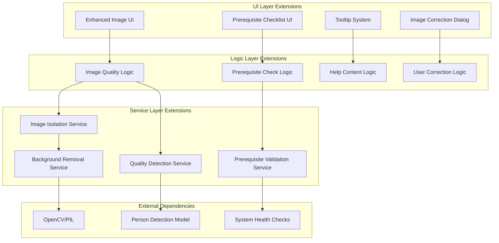
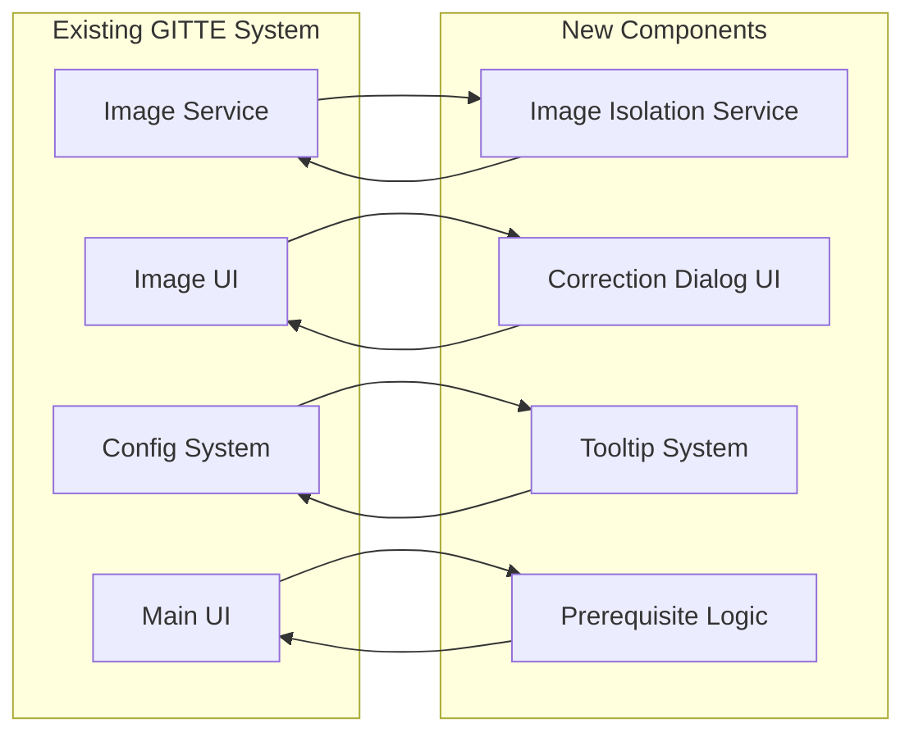

# Design Document

## Overview

This design document outlines the implementation of two major UX enhancements for the GITTE system: automated image isolation with user correction capabilities, and context-sensitive help with prerequisite validation. These features integrate seamlessly with the existing 4-layer architecture while significantly improving user experience and system reliability.

### Key Design Principles

1. **Seamless Integration**: All new features follow the existing 4-layer architecture (UI → Logic → Service → Data)
2. **User Control**: Automated processes provide suggestions while preserving user agency and manual override capabilities
3. **Progressive Enhancement**: Features degrade gracefully when dependencies are unavailable
4. **Accessibility First**: All new UI components meet WCAG 2.1 AA standards
5. **Performance Conscious**: New features maintain existing performance benchmarks
6. **Configuration Driven**: All behavior controlled through centralized configuration with feature flags

## Architecture

### High-Level Architecture Integration



### Component Integration with Existing System



## Components and Interfaces

### 1. Image Isolation and Quality Detection System

#### Image Isolation Service
```python
from dataclasses import dataclass
from typing import Optional, Tuple
import cv2
import numpy as np
from PIL import Image

@dataclass
class IsolationResult:
    """Result of image isolation process."""
    success: bool
    isolated_image_path: Optional[str]
    original_image_path: str
    confidence_score: float
    processing_time: float
    method_used: str
    error_message: Optional[str] = None

@dataclass
class QualityAnalysis:
    """Result of image quality analysis."""
    is_valid: bool
    person_detected: bool
    person_count: int
    quality_score: float
    issues: list[str]
    confidence_scores: dict[str, float]

class ImageIsolationService:
    """Service for automated image isolation and background removal."""
    
    def __init__(self, config: ImageIsolationConfig):
        self.config = config
        self.person_detector = self._initialize_person_detector()
        self.background_remover = self._initialize_background_remover()
    
    def isolate_person(self, image_path: str) -> IsolationResult:
        """
        Isolate person from background in image.
        
        Args:
            image_path: Path to input image
            
        Returns:
            IsolationResult with isolated image and metadata
        """
        pass
    
    def analyze_image_quality(self, image_path: str) -> QualityAnalysis:
        """
        Analyze image for quality issues and person detection.
        
        Args:
            image_path: Path to image to analyze
            
        Returns:
            QualityAnalysis with validation results
        """
        pass
    
    def create_transparent_background(self, image_path: str, mask: np.ndarray) -> str:
        """Create image with transparent background using mask."""
        pass
    
    def create_uniform_background(self, image_path: str, mask: np.ndarray, color: Tuple[int, int, int]) -> str:
        """Create image with uniform color background using mask."""
        pass
    
    def _initialize_person_detector(self):
        """Initialize person detection model."""
        pass
    
    def _initialize_background_remover(self):
        """Initialize background removal model."""
        pass

@dataclass
class ImageIsolationConfig:
    """Configuration for image isolation service."""
    enabled: bool = True
    detection_confidence_threshold: float = 0.7
    edge_refinement_enabled: bool = True
    background_removal_method: str = "rembg"  # rembg, opencv, manual
    fallback_to_original: bool = True
    max_processing_time: int = 10  # seconds
    output_format: str = "PNG"  # PNG for transparency support
    uniform_background_color: Tuple[int, int, int] = (255, 255, 255)
```

#### Quality Detection Service
```python
class ImageQualityDetector:
    """Detector for image quality and content validation."""
    
    def __init__(self, config: QualityDetectionConfig):
        self.config = config
        self.person_classifier = self._load_person_classifier()
        self.quality_analyzer = self._load_quality_analyzer()
    
    def detect_people(self, image_path: str) -> dict:
        """Detect people in image and return count and bounding boxes."""
        pass
    
    def assess_image_quality(self, image_path: str) -> dict:
        """Assess overall image quality (blur, noise, corruption)."""
        pass
    
    def validate_subject_type(self, image_path: str) -> dict:
        """Validate that image contains appropriate subject (person)."""
        pass
    
    def is_image_suitable(self, image_path: str) -> QualityAnalysis:
        """Comprehensive suitability check for embodiment images."""
        pass

@dataclass
class QualityDetectionConfig:
    """Configuration for quality detection."""
    enabled: bool = True
    min_person_confidence: float = 0.8
    max_people_allowed: int = 1
    min_quality_score: float = 0.6
    blur_threshold: float = 100.0
    noise_threshold: float = 0.1
```

### 2. User Correction Dialog System

#### Correction Dialog UI Component
```python
import streamlit as st
from PIL import Image, ImageDraw
import numpy as np

class ImageCorrectionDialog:
    """Interactive dialog for image correction and approval."""
    
    def __init__(self):
        self.crop_coordinates = None
        self.user_feedback = None
    
    def render_correction_interface(
        self, 
        original_image_path: str, 
        processed_image_path: str,
        isolation_result: IsolationResult
    ) -> dict:
        """
        Render the correction dialog interface.
        
        Returns:
            dict: User decisions and corrections
        """
        st.subheader("🎨 Review Your Generated Avatar")
        
        # Side-by-side comparison
        col1, col2 = st.columns(2)
        
        with col1:
            st.write("**Original Image**")
            original_img = Image.open(original_image_path)
            st.image(original_img, caption="Generated Image")
        
        with col2:
            st.write("**Processed Image**")
            if processed_image_path and isolation_result.success:
                processed_img = Image.open(processed_image_path)
                st.image(processed_img, caption="Isolated Avatar")
            else:
                st.warning("Automatic processing failed")
                st.image(original_img, caption="Original (Fallback)")
        
        # User decision options
        st.write("**What would you like to do?**")
        
        decision = st.radio(
            "Choose an option:",
            options=[
                "Accept processed image",
                "Adjust crop/selection",
                "Use original image",
                "Mark as garbage and regenerate"
            ],
            help="Select how you want to proceed with this image"
        )
        
        result = {"decision": decision}
        
        if decision == "Adjust crop/selection":
            result.update(self._render_crop_adjustment(original_image_path))
        elif decision == "Mark as garbage and regenerate":
            result.update(self._render_regeneration_options())
        
        return result
    
    def _render_crop_adjustment(self, image_path: str) -> dict:
        """Render interactive crop adjustment interface."""
        st.write("**Adjust Selection Area**")
        
        # Load image for cropping
        image = Image.open(image_path)
        
        # Crop parameters
        col1, col2 = st.columns(2)
        
        with col1:
            left = st.slider("Left", 0, image.width, 0)
            top = st.slider("Top", 0, image.height, 0)
        
        with col2:
            right = st.slider("Right", left, image.width, image.width)
            bottom = st.slider("Bottom", top, image.height, image.height)
        
        # Preview crop
        if st.button("Preview Crop"):
            cropped = image.crop((left, top, right, bottom))
            st.image(cropped, caption="Crop Preview")
        
        return {
            "crop_coordinates": (left, top, right, bottom),
            "preview_available": True
        }
    
    def _render_regeneration_options(self) -> dict:
        """Render options for image regeneration."""
        st.write("**Regeneration Options**")
        
        reason = st.selectbox(
            "Why is this image unsuitable?",
            options=[
                "Wrong person/character",
                "Poor image quality",
                "Inappropriate content",
                "Multiple people",
                "Background issues",
                "Other"
            ]
        )
        
        if reason == "Other":
            custom_reason = st.text_input("Please specify:")
            reason = custom_reason if custom_reason else reason
        
        modifications = st.text_area(
            "Suggested improvements for regeneration:",
            placeholder="Describe what should be different in the new image..."
        )
        
        return {
            "rejection_reason": reason,
            "suggested_modifications": modifications
        }

class CorrectionDialogLogic:
    """Logic layer for handling correction dialog interactions."""
    
    def __init__(self, image_service, isolation_service):
        self.image_service = image_service
        self.isolation_service = isolation_service
    
    def process_user_correction(
        self, 
        user_id: UUID, 
        image_path: str, 
        correction_data: dict
    ) -> str:
        """
        Process user correction and return final image path.
        
        Args:
            user_id: User identifier
            image_path: Original image path
            correction_data: User correction decisions
            
        Returns:
            str: Path to final processed image
        """
        decision = correction_data.get("decision")
        
        if decision == "Accept processed image":
            return correction_data.get("processed_image_path", image_path)
        
        elif decision == "Adjust crop/selection":
            return self._apply_manual_crop(image_path, correction_data)
        
        elif decision == "Use original image":
            return image_path
        
        elif decision == "Mark as garbage and regenerate":
            return self._trigger_regeneration(user_id, correction_data)
        
        return image_path
    
    def _apply_manual_crop(self, image_path: str, correction_data: dict) -> str:
        """Apply manual crop based on user selection."""
        pass
    
    def _trigger_regeneration(self, user_id: UUID, correction_data: dict) -> str:
        """Trigger image regeneration with modifications."""
        pass
```

### 3. Context-Sensitive Tooltip System

#### Tooltip Service
```python
from dataclasses import dataclass
from typing import Dict, Optional, Callable

@dataclass
class TooltipContent:
    """Content for a tooltip."""
    title: str
    description: str
    action_text: Optional[str] = None
    action_callback: Optional[Callable] = None
    help_link: Optional[str] = None
    accessibility_label: Optional[str] = None

class TooltipSystem:
    """System for managing context-sensitive tooltips."""
    
    def __init__(self, config: TooltipConfig):
        self.config = config
        self.tooltip_registry: Dict[str, TooltipContent] = {}
        self._initialize_default_tooltips()
    
    def register_tooltip(self, element_id: str, content: TooltipContent):
        """Register tooltip content for an element."""
        self.tooltip_registry[element_id] = content
    
    def get_tooltip(self, element_id: str, context: dict = None) -> Optional[TooltipContent]:
        """Get tooltip content for an element with context."""
        base_tooltip = self.tooltip_registry.get(element_id)
        if not base_tooltip:
            return None
        
        # Apply context-specific modifications
        if context:
            return self._contextualize_tooltip(base_tooltip, context)
        
        return base_tooltip
    
    def render_tooltip(self, element_id: str, context: dict = None) -> str:
        """Render tooltip HTML/markdown for an element."""
        tooltip = self.get_tooltip(element_id, context)
        if not tooltip:
            return ""
        
        return self._render_tooltip_html(tooltip)
    
    def _initialize_default_tooltips(self):
        """Initialize default tooltips for common elements."""
        self.tooltip_registry.update({
            "register_button": TooltipContent(
                title="Registration",
                description="Create your GITTE account to access personalized learning features",
                action_text="Complete required fields to enable"
            ),
            "consent_checkbox": TooltipContent(
                title="Data Processing Consent",
                description="Required to use AI features like chat and image generation",
                action_text="Check this box to provide consent"
            ),
            "image_generation_button": TooltipContent(
                title="Generate Avatar",
                description="Create visual representation of your learning assistant",
                action_text="Complete embodiment design first"
            ),
            "chat_input": TooltipContent(
                title="Chat with GITTE",
                description="Interact with your personalized learning assistant",
                action_text="Provide consent and complete setup"
            )
        })
    
    def _contextualize_tooltip(self, tooltip: TooltipContent, context: dict) -> TooltipContent:
        """Apply context-specific modifications to tooltip."""
        # Create copy to avoid modifying original
        contextualized = TooltipContent(
            title=tooltip.title,
            description=tooltip.description,
            action_text=tooltip.action_text,
            action_callback=tooltip.action_callback,
            help_link=tooltip.help_link,
            accessibility_label=tooltip.accessibility_label
        )
        
        # Apply context-specific logic
        if context.get("disabled") and context.get("reason"):
            contextualized.description = f"{tooltip.description}. Currently disabled: {context['reason']}"
        
        return contextualized
    
    def _render_tooltip_html(self, tooltip: TooltipContent) -> str:
        """Render tooltip as HTML."""
        html = f"""
        <div class="gitte-tooltip" role="tooltip" aria-label="{tooltip.accessibility_label or tooltip.title}">
            <div class="tooltip-title">{tooltip.title}</div>
            <div class="tooltip-description">{tooltip.description}</div>
            {f'<div class="tooltip-action">{tooltip.action_text}</div>' if tooltip.action_text else ''}
            {f'<a href="{tooltip.help_link}" class="tooltip-help">Learn more</a>' if tooltip.help_link else ''}
        </div>
        """
        return html

@dataclass
class TooltipConfig:
    """Configuration for tooltip system."""
    enabled: bool = True
    show_delay_ms: int = 500
    hide_delay_ms: int = 200
    max_width: int = 300
    position: str = "auto"  # auto, top, bottom, left, right
    theme: str = "default"
```

#### Streamlit Tooltip Integration
```python
import streamlit as st
import streamlit.components.v1 as components

class StreamlitTooltipRenderer:
    """Streamlit-specific tooltip rendering."""
    
    def __init__(self, tooltip_system: TooltipSystem):
        self.tooltip_system = tooltip_system
        self._inject_tooltip_css()
    
    def render_button_with_tooltip(
        self, 
        label: str, 
        tooltip_id: str, 
        disabled: bool = False,
        context: dict = None,
        **button_kwargs
    ):
        """Render button with integrated tooltip."""
        tooltip_context = context or {}
        if disabled:
            tooltip_context["disabled"] = True
            tooltip_context["reason"] = tooltip_context.get("reason", "Prerequisites not met")
        
        tooltip = self.tooltip_system.get_tooltip(tooltip_id, tooltip_context)
        
        if tooltip:
            help_text = f"{tooltip.description}"
            if tooltip.action_text and disabled:
                help_text += f" {tooltip.action_text}"
        else:
            help_text = None
        
        return st.button(
            label, 
            disabled=disabled, 
            help=help_text,
            **button_kwargs
        )
    
    def render_input_with_tooltip(
        self,
        input_type: str,
        label: str,
        tooltip_id: str,
        context: dict = None,
        **input_kwargs
    ):
        """Render input field with tooltip."""
        tooltip = self.tooltip_system.get_tooltip(tooltip_id, context)
        help_text = tooltip.description if tooltip else None
        
        input_func = getattr(st, input_type)
        return input_func(label, help=help_text, **input_kwargs)
    
    def _inject_tooltip_css(self):
        """Inject CSS for tooltip styling."""
        css = """
        <style>
        .gitte-tooltip {
            background: #333;
            color: white;
            padding: 8px 12px;
            border-radius: 4px;
            font-size: 14px;
            max-width: 300px;
            box-shadow: 0 2px 8px rgba(0,0,0,0.2);
        }
        .tooltip-title {
            font-weight: bold;
            margin-bottom: 4px;
        }
        .tooltip-description {
            margin-bottom: 4px;
        }
        .tooltip-action {
            font-style: italic;
            color: #ccc;
        }
        .tooltip-help {
            color: #4CAF50;
            text-decoration: none;
        }
        </style>
        """
        st.markdown(css, unsafe_allow_html=True)
```

### 4. Prerequisite Check System

#### Prerequisite Validation Service
```python
from abc import ABC, abstractmethod
from dataclasses import dataclass
from enum import Enum
from typing import List, Dict, Any, Optional

class PrerequisiteType(Enum):
    REQUIRED = "required"
    RECOMMENDED = "recommended"
    OPTIONAL = "optional"

class PrerequisiteStatus(Enum):
    PASSED = "passed"
    FAILED = "failed"
    WARNING = "warning"
    UNKNOWN = "unknown"

@dataclass
class PrerequisiteResult:
    """Result of a prerequisite check."""
    name: str
    status: PrerequisiteStatus
    message: str
    details: Optional[str] = None
    resolution_steps: List[str] = None
    check_time: float = 0.0

@dataclass
class PrerequisiteCheckSuite:
    """Complete prerequisite check results."""
    overall_status: PrerequisiteStatus
    required_passed: bool
    recommended_passed: bool
    results: List[PrerequisiteResult]
    total_check_time: float
    timestamp: str

class PrerequisiteChecker(ABC):
    """Abstract base class for prerequisite checkers."""
    
    @abstractmethod
    def check(self) -> PrerequisiteResult:
        """Perform the prerequisite check."""
        pass
    
    @property
    @abstractmethod
    def name(self) -> str:
        """Name of the prerequisite."""
        pass
    
    @property
    @abstractmethod
    def prerequisite_type(self) -> PrerequisiteType:
        """Type of prerequisite."""
        pass

class OllamaConnectivityChecker(PrerequisiteChecker):
    """Check Ollama service connectivity."""
    
    def __init__(self, config: LLMConfig):
        self.config = config
    
    def check(self) -> PrerequisiteResult:
        """Check if Ollama is accessible."""
        import requests
        import time
        
        start_time = time.time()
        
        try:
            response = requests.get(
                f"{self.config.ollama_url}/api/tags",
                timeout=5
            )
            
            if response.status_code == 200:
                models = response.json().get("models", [])
                model_count = len(models)
                
                return PrerequisiteResult(
                    name=self.name,
                    status=PrerequisiteStatus.PASSED,
                    message=f"Ollama connected successfully ({model_count} models available)",
                    details=f"Available models: {[m['name'] for m in models[:3]]}",
                    check_time=time.time() - start_time
                )
            else:
                return PrerequisiteResult(
                    name=self.name,
                    status=PrerequisiteStatus.FAILED,
                    message=f"Ollama responded with status {response.status_code}",
                    resolution_steps=[
                        "Check if Ollama is running",
                        "Verify Ollama URL configuration",
                        "Check network connectivity"
                    ],
                    check_time=time.time() - start_time
                )
                
        except requests.exceptions.ConnectionError:
            return PrerequisiteResult(
                name=self.name,
                status=PrerequisiteStatus.FAILED,
                message="Cannot connect to Ollama service",
                resolution_steps=[
                    "Start Ollama service: 'ollama serve'",
                    "Check if Ollama is installed",
                    "Verify firewall settings"
                ],
                check_time=time.time() - start_time
            )
        except Exception as e:
            return PrerequisiteResult(
                name=self.name,
                status=PrerequisiteStatus.FAILED,
                message=f"Unexpected error: {str(e)}",
                check_time=time.time() - start_time
            )
    
    @property
    def name(self) -> str:
        return "Ollama LLM Service"
    
    @property
    def prerequisite_type(self) -> PrerequisiteType:
        return PrerequisiteType.REQUIRED

class DatabaseConnectivityChecker(PrerequisiteChecker):
    """Check PostgreSQL database connectivity."""
    
    def __init__(self, config: DatabaseConfig):
        self.config = config
    
    def check(self) -> PrerequisiteResult:
        """Check database connectivity."""
        import time
        from sqlalchemy import create_engine, text
        
        start_time = time.time()
        
        try:
            engine = create_engine(self.config.dsn)
            with engine.connect() as conn:
                result = conn.execute(text("SELECT version()"))
                version = result.fetchone()[0]
                
                return PrerequisiteResult(
                    name=self.name,
                    status=PrerequisiteStatus.PASSED,
                    message="Database connected successfully",
                    details=f"PostgreSQL version: {version[:50]}...",
                    check_time=time.time() - start_time
                )
                
        except Exception as e:
            return PrerequisiteResult(
                name=self.name,
                status=PrerequisiteStatus.FAILED,
                message=f"Database connection failed: {str(e)}",
                resolution_steps=[
                    "Check if PostgreSQL is running",
                    "Verify database credentials",
                    "Check network connectivity",
                    "Run database migrations"
                ],
                check_time=time.time() - start_time
            )
    
    @property
    def name(self) -> str:
        return "PostgreSQL Database"
    
    @property
    def prerequisite_type(self) -> PrerequisiteType:
        return PrerequisiteType.REQUIRED

class ConsentStatusChecker(PrerequisiteChecker):
    """Check user consent status."""
    
    def __init__(self, user_id: UUID, consent_service):
        self.user_id = user_id
        self.consent_service = consent_service
    
    def check(self) -> PrerequisiteResult:
        """Check user consent status."""
        import time
        
        start_time = time.time()
        
        try:
            # Check required consents
            required_consents = [
                ConsentType.DATA_PROCESSING,
                ConsentType.LLM_INTERACTION,
                ConsentType.IMAGE_GENERATION
            ]
            
            consent_status = {}
            for consent_type in required_consents:
                consent_status[consent_type.value] = self.consent_service.check_consent(
                    self.user_id, consent_type
                )
            
            missing_consents = [
                consent for consent, granted in consent_status.items() 
                if not granted
            ]
            
            if not missing_consents:
                return PrerequisiteResult(
                    name=self.name,
                    status=PrerequisiteStatus.PASSED,
                    message="All required consents provided",
                    details=f"Consents: {list(consent_status.keys())}",
                    check_time=time.time() - start_time
                )
            else:
                return PrerequisiteResult(
                    name=self.name,
                    status=PrerequisiteStatus.FAILED,
                    message=f"Missing consents: {', '.join(missing_consents)}",
                    resolution_steps=[
                        "Go to Consent Settings",
                        "Review and accept required consents",
                        "Refresh the page"
                    ],
                    check_time=time.time() - start_time
                )
                
        except Exception as e:
            return PrerequisiteResult(
                name=self.name,
                status=PrerequisiteStatus.FAILED,
                message=f"Error checking consent: {str(e)}",
                check_time=time.time() - start_time
            )
    
    @property
    def name(self) -> str:
        return "User Consent"
    
    @property
    def prerequisite_type(self) -> PrerequisiteType:
        return PrerequisiteType.REQUIRED

class PrerequisiteValidationService:
    """Service for managing and running prerequisite checks."""
    
    def __init__(self, config: PrerequisiteConfig):
        self.config = config
        self.checkers: List[PrerequisiteChecker] = []
        self.cache: Dict[str, PrerequisiteResult] = {}
        self.cache_ttl = config.cache_ttl_seconds
    
    def register_checker(self, checker: PrerequisiteChecker):
        """Register a prerequisite checker."""
        self.checkers.append(checker)
    
    def run_all_checks(self, use_cache: bool = True) -> PrerequisiteCheckSuite:
        """Run all registered prerequisite checks."""
        import time
        from datetime import datetime
        
        start_time = time.time()
        results = []
        
        for checker in self.checkers:
            if use_cache and self._is_cached_valid(checker.name):
                result = self.cache[checker.name]
            else:
                result = checker.check()
                self.cache[checker.name] = result
            
            results.append(result)
        
        # Determine overall status
        required_results = [r for r in results if self._get_checker_type(r.name) == PrerequisiteType.REQUIRED]
        recommended_results = [r for r in results if self._get_checker_type(r.name) == PrerequisiteType.RECOMMENDED]
        
        required_passed = all(r.status == PrerequisiteStatus.PASSED for r in required_results)
        recommended_passed = all(r.status == PrerequisiteStatus.PASSED for r in recommended_results)
        
        if required_passed and recommended_passed:
            overall_status = PrerequisiteStatus.PASSED
        elif required_passed:
            overall_status = PrerequisiteStatus.WARNING
        else:
            overall_status = PrerequisiteStatus.FAILED
        
        return PrerequisiteCheckSuite(
            overall_status=overall_status,
            required_passed=required_passed,
            recommended_passed=recommended_passed,
            results=results,
            total_check_time=time.time() - start_time,
            timestamp=datetime.now().isoformat()
        )
    
    def run_specific_check(self, checker_name: str) -> Optional[PrerequisiteResult]:
        """Run a specific prerequisite check."""
        for checker in self.checkers:
            if checker.name == checker_name:
                result = checker.check()
                self.cache[checker.name] = result
                return result
        return None
    
    def _is_cached_valid(self, checker_name: str) -> bool:
        """Check if cached result is still valid."""
        if checker_name not in self.cache:
            return False
        
        # For now, simple time-based cache invalidation
        # In production, might want more sophisticated caching
        return True
    
    def _get_checker_type(self, checker_name: str) -> PrerequisiteType:
        """Get the type of a checker by name."""
        for checker in self.checkers:
            if checker.name == checker_name:
                return checker.prerequisite_type
        return PrerequisiteType.OPTIONAL

@dataclass
class PrerequisiteConfig:
    """Configuration for prerequisite checking."""
    enabled: bool = True
    cache_ttl_seconds: int = 300  # 5 minutes
    run_on_startup: bool = True
    run_before_critical_operations: bool = True
    show_detailed_errors: bool = True
    auto_retry_failed_checks: bool = True
    max_retry_attempts: int = 3
```

#### Prerequisite UI Components
```python
class PrerequisiteChecklistUI:
    """UI component for displaying prerequisite checklist."""
    
    def __init__(self, validation_service: PrerequisiteValidationService):
        self.validation_service = validation_service
    
    def render_prerequisite_checklist(
        self, 
        user_id: UUID, 
        context: str = "general"
    ) -> bool:
        """
        Render prerequisite checklist UI.
        
        Returns:
            bool: True if all required prerequisites are met
        """
        st.subheader("🔍 System Prerequisites Check")
        
        # Run checks
        with st.spinner("Checking system prerequisites..."):
            check_suite = self.validation_service.run_all_checks()
        
        # Overall status
        if check_suite.overall_status == PrerequisiteStatus.PASSED:
            st.success("✅ All prerequisites met!")
        elif check_suite.overall_status == PrerequisiteStatus.WARNING:
            st.warning("⚠️ Some recommended prerequisites are missing")
        else:
            st.error("❌ Required prerequisites are missing")
        
        # Detailed results
        with st.expander("Detailed Results", expanded=check_suite.overall_status != PrerequisiteStatus.PASSED):
            for result in check_suite.results:
                self._render_prerequisite_result(result)
        
        # Action buttons
        col1, col2, col3 = st.columns(3)
        
        with col1:
            if st.button("🔄 Recheck All"):
                st.rerun()
        
        with col2:
            if st.button("📋 Export Report"):
                self._export_prerequisite_report(check_suite)
        
        with col3:
            if check_suite.required_passed:
                st.success("Ready to proceed!")
            else:
                st.error("Cannot proceed")
        
        return check_suite.required_passed
    
    def _render_prerequisite_result(self, result: PrerequisiteResult):
        """Render individual prerequisite result."""
        # Status icon
        if result.status == PrerequisiteStatus.PASSED:
            icon = "✅"
            color = "green"
        elif result.status == PrerequisiteStatus.WARNING:
            icon = "⚠️"
            color = "orange"
        else:
            icon = "❌"
            color = "red"
        
        # Main result
        st.markdown(f"{icon} **{result.name}**: {result.message}")
        
        # Details
        if result.details:
            st.caption(result.details)
        
        # Resolution steps
        if result.resolution_steps and result.status != PrerequisiteStatus.PASSED:
            with st.expander(f"How to fix {result.name}"):
                for i, step in enumerate(result.resolution_steps, 1):
                    st.write(f"{i}. {step}")
        
        # Performance info
        if result.check_time > 0:
            st.caption(f"Check completed in {result.check_time:.2f}s")
    
    def _export_prerequisite_report(self, check_suite: PrerequisiteCheckSuite):
        """Export prerequisite report."""
        import json
        
        report = {
            "timestamp": check_suite.timestamp,
            "overall_status": check_suite.overall_status.value,
            "required_passed": check_suite.required_passed,
            "recommended_passed": check_suite.recommended_passed,
            "total_check_time": check_suite.total_check_time,
            "results": [
                {
                    "name": r.name,
                    "status": r.status.value,
                    "message": r.message,
                    "details": r.details,
                    "resolution_steps": r.resolution_steps,
                    "check_time": r.check_time
                }
                for r in check_suite.results
            ]
        }
        
        st.download_button(
            label="Download Report",
            data=json.dumps(report, indent=2),
            file_name=f"gitte_prerequisites_{check_suite.timestamp}.json",
            mime="application/json"
        )

class PrerequisiteLogic:
    """Logic layer for prerequisite management."""
    
    def __init__(self, validation_service: PrerequisiteValidationService):
        self.validation_service = validation_service
    
    def check_prerequisites_for_operation(
        self, 
        operation: str, 
        user_id: UUID = None
    ) -> PrerequisiteCheckSuite:
        """Check prerequisites for a specific operation."""
        # Register operation-specific checkers
        if operation == "chat":
            self._register_chat_prerequisites(user_id)
        elif operation == "image_generation":
            self._register_image_prerequisites(user_id)
        elif operation == "registration":
            self._register_registration_prerequisites()
        
        return self.validation_service.run_all_checks()
    
    def _register_chat_prerequisites(self, user_id: UUID):
        """Register prerequisites for chat functionality."""
        # Clear existing checkers
        self.validation_service.checkers.clear()
        
        # Add chat-specific checkers
        self.validation_service.register_checker(
            OllamaConnectivityChecker(config.llm)
        )
        
        if user_id:
            self.validation_service.register_checker(
                ConsentStatusChecker(user_id, get_consent_service())
            )
    
    def _register_image_prerequisites(self, user_id: UUID):
        """Register prerequisites for image generation."""
        self.validation_service.checkers.clear()
        
        # Add image-specific checkers
        self.validation_service.register_checker(
            OllamaConnectivityChecker(config.llm)
        )
        
        if user_id:
            self.validation_service.register_checker(
                ConsentStatusChecker(user_id, get_consent_service())
            )
    
    def _register_registration_prerequisites(self):
        """Register prerequisites for registration."""
        self.validation_service.checkers.clear()
        
        self.validation_service.register_checker(
            DatabaseConnectivityChecker(config.database)
        )
```

## Data Models

### Image Processing Data Models

```sql
-- Image isolation and quality tracking
CREATE TABLE image_processing_results (
    id UUID PRIMARY KEY DEFAULT gen_random_uuid(),
    original_image_path VARCHAR(500) NOT NULL,
    processed_image_path VARCHAR(500),
    user_id UUID REFERENCES users(id),
    processing_method VARCHAR(100) NOT NULL,
    isolation_success BOOLEAN NOT NULL,
    quality_score FLOAT,
    person_detected BOOLEAN,
    person_count INTEGER,
    confidence_score FLOAT,
    processing_time_ms INTEGER,
    issues JSONB,
    created_at TIMESTAMP DEFAULT CURRENT_TIMESTAMP
);

-- User corrections and feedback
CREATE TABLE image_corrections (
    id UUID PRIMARY KEY DEFAULT gen_random_uuid(),
    processing_result_id UUID REFERENCES image_processing_results(id),
    user_id UUID REFERENCES users(id),
    correction_type VARCHAR(100) NOT NULL, -- accept, adjust, reject, regenerate
    crop_coordinates JSONB,
    rejection_reason VARCHAR(500),
    suggested_modifications TEXT,
    final_image_path VARCHAR(500),
    created_at TIMESTAMP DEFAULT CURRENT_TIMESTAMP
);

-- Prerequisite check results
CREATE TABLE prerequisite_checks (
    id UUID PRIMARY KEY DEFAULT gen_random_uuid(),
    user_id UUID REFERENCES users(id),
    check_context VARCHAR(100) NOT NULL, -- startup, chat, image_generation, etc.
    overall_status VARCHAR(50) NOT NULL,
    required_passed BOOLEAN NOT NULL,
    recommended_passed BOOLEAN NOT NULL,
    total_check_time_ms INTEGER,
    results JSONB NOT NULL,
    created_at TIMESTAMP DEFAULT CURRENT_TIMESTAMP
);

-- Tooltip interactions and effectiveness
CREATE TABLE tooltip_interactions (
    id UUID PRIMARY KEY DEFAULT gen_random_uuid(),
    user_id UUID REFERENCES users(id),
    element_id VARCHAR(200) NOT NULL,
    interaction_type VARCHAR(100) NOT NULL, -- hover, click, dismiss
    context JSONB,
    session_id VARCHAR(100),
    created_at TIMESTAMP DEFAULT CURRENT_TIMESTAMP
);
```

## Error Handling

### Error Handling Strategy

#### 1. Image Processing Errors
```python
class ImageProcessingError(Exception):
    """Base exception for image processing errors."""
    pass

class IsolationFailedError(ImageProcessingError):
    """Raised when image isolation fails."""
    pass

class QualityDetectionError(ImageProcessingError):
    """Raised when quality detection fails."""
    pass

class PersonDetectionError(ImageProcessingError):
    """Raised when person detection fails."""
    pass

# Error handling in service layer
def isolate_person_with_fallback(self, image_path: str) -> IsolationResult:
    """Isolate person with graceful fallback."""
    try:
        return self.isolate_person(image_path)
    except IsolationFailedError as e:
        logger.warning(f"Isolation failed, using original: {e}")
        return IsolationResult(
            success=False,
            isolated_image_path=None,
            original_image_path=image_path,
            confidence_score=0.0,
            processing_time=0.0,
            method_used="fallback",
            error_message=str(e)
        )
    except Exception as e:
        logger.error(f"Unexpected isolation error: {e}")
        return IsolationResult(
            success=False,
            isolated_image_path=None,
            original_image_path=image_path,
            confidence_score=0.0,
            processing_time=0.0,
            method_used="error_fallback",
            error_message=f"Unexpected error: {e}"
        )
```

#### 2. Prerequisite Check Errors
```python
class PrerequisiteError(Exception):
    """Base exception for prerequisite errors."""
    pass

class CheckTimeoutError(PrerequisiteError):
    """Raised when prerequisite check times out."""
    pass

class ServiceUnavailableError(PrerequisiteError):
    """Raised when required service is unavailable."""
    pass

# Graceful degradation
def run_checks_with_timeout(self, timeout_seconds: int = 30) -> PrerequisiteCheckSuite:
    """Run checks with timeout and graceful degradation."""
    import signal
    
    def timeout_handler(signum, frame):
        raise CheckTimeoutError("Prerequisite checks timed out")
    
    signal.signal(signal.SIGALRM, timeout_handler)
    signal.alarm(timeout_seconds)
    
    try:
        return self.run_all_checks()
    except CheckTimeoutError:
        logger.warning("Prerequisite checks timed out, using cached results")
        return self._get_cached_results_or_defaults()
    finally:
        signal.alarm(0)
```

## Testing Strategy

### Testing Approach

#### 1. Unit Tests for Image Processing
```python
class TestImageIsolationService:
    """Test image isolation functionality."""
    
    def test_successful_isolation(self):
        """Test successful person isolation."""
        service = ImageIsolationService(test_config)
        result = service.isolate_person("test_person.jpg")
        
        assert result.success
        assert result.isolated_image_path is not None
        assert result.confidence_score > 0.7
    
    def test_isolation_fallback(self):
        """Test fallback when isolation fails."""
        service = ImageIsolationService(test_config)
        result = service.isolate_person("no_person.jpg")
        
        assert not result.success
        assert result.isolated_image_path is None
        assert result.error_message is not None
    
    def test_quality_detection(self):
        """Test image quality detection."""
        service = ImageIsolationService(test_config)
        analysis = service.analyze_image_quality("good_quality.jpg")
        
        assert analysis.is_valid
        assert analysis.person_detected
        assert analysis.person_count == 1
```

#### 2. Integration Tests for Prerequisite System
```python
class TestPrerequisiteSystem:
    """Test prerequisite checking system."""
    
    def test_all_prerequisites_pass(self):
        """Test when all prerequisites pass."""
        service = PrerequisiteValidationService(test_config)
        service.register_checker(MockOllamaChecker(healthy=True))
        service.register_checker(MockDatabaseChecker(healthy=True))
        
        suite = service.run_all_checks()
        
        assert suite.overall_status == PrerequisiteStatus.PASSED
        assert suite.required_passed
    
    def test_required_prerequisite_fails(self):
        """Test when required prerequisite fails."""
        service = PrerequisiteValidationService(test_config)
        service.register_checker(MockOllamaChecker(healthy=False))
        
        suite = service.run_all_checks()
        
        assert suite.overall_status == PrerequisiteStatus.FAILED
        assert not suite.required_passed
```

#### 3. UI Component Tests
```python
class TestCorrectionDialog:
    """Test image correction dialog."""
    
    def test_render_correction_interface(self):
        """Test correction dialog rendering."""
        dialog = ImageCorrectionDialog()
        
        # Mock Streamlit components
        with patch('streamlit.columns'), patch('streamlit.image'):
            result = dialog.render_correction_interface(
                "original.jpg", 
                "processed.jpg", 
                mock_isolation_result
            )
        
        assert "decision" in result
    
    def test_crop_adjustment(self):
        """Test crop adjustment functionality."""
        dialog = ImageCorrectionDialog()
        
        with patch('streamlit.slider') as mock_slider:
            mock_slider.return_value = 100
            result = dialog._render_crop_adjustment("test.jpg")
        
        assert "crop_coordinates" in result
```

## Performance Considerations

### Performance Optimization

#### 1. Image Processing Performance
- **Lazy Loading**: Load image processing models only when needed
- **Caching**: Cache processed images and quality analysis results
- **Async Processing**: Use background processing for non-critical operations
- **Resource Management**: Properly manage GPU memory and CPU resources

#### 2. Prerequisite Check Performance
- **Caching**: Cache prerequisite results with appropriate TTL
- **Parallel Execution**: Run independent checks in parallel
- **Circuit Breaker**: Implement circuit breaker pattern for external service checks
- **Timeout Management**: Set appropriate timeouts for all checks

#### 3. UI Performance
- **Lazy Rendering**: Render tooltips and dialogs only when needed
- **Debouncing**: Debounce user interactions to prevent excessive API calls
- **Progressive Loading**: Load UI components progressively
- **Memory Management**: Clean up resources when components are unmounted

This comprehensive design provides a solid foundation for implementing the UX enhancements while maintaining the existing system's architecture and performance standards.