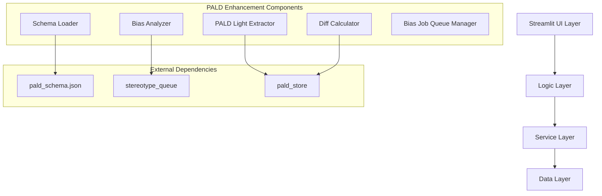
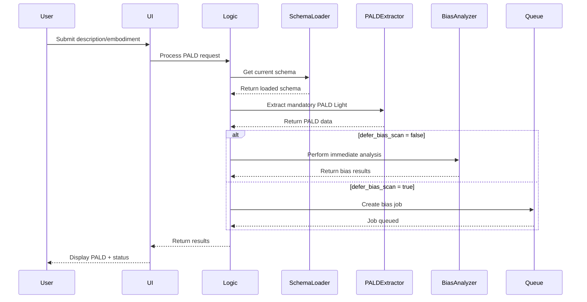

# Design Document

## Overview

This design document outlines the architecture and implementation approach for enhancing the PALD (Pedagogical Agent Level of Design) system with advanced bias analysis capabilities, runtime schema management, and improved Streamlit form interactions. The enhancement separates mandatory PALD extraction from optional bias analysis, implements deferred processing for performance optimization, and removes standard button usage for better accessibility.

## Architecture

### High-Level Architecture



### Component Interaction Flow



## Components and Interfaces

### 1. Schema Management System

#### PALDSchemaLoader
```python
class PALDSchemaLoader:
    """Handles runtime loading and validation of PALD schemas."""
    
    def __init__(self, schema_path: str):
        self.schema_path = schema_path
        self.cached_schema: dict[str, Any] | None = None
        self.last_modified: float | None = None
    
    def load_schema(self) -> dict[str, Any]:
        """Load schema from file with caching and validation."""
        
    def validate_schema(self, schema: dict[str, Any]) -> bool:
        """Validate schema structure and content."""
        
    def get_default_schema(self) -> dict[str, Any]:
        """Return fallback schema if file loading fails."""
        
    def detect_schema_changes(self) -> bool:
        """Check if schema file has been modified."""
```

#### SchemaEvolutionManager
```python
class SchemaEvolutionManager:
    """Manages schema evolution and new field integration."""
    
    def queue_new_field(self, field_name: str, field_data: Any, context: str):
        """Queue new field for review and integration."""
        
    def validate_against_baseline(self, new_schema: dict[str, Any]) -> ValidationResult:
        """Validate evolved schema against baseline."""
        
    def apply_governance_rules(self, candidates: list[FieldCandidate]) -> list[FieldCandidate]:
        """Apply governance rules to field candidates."""
```

### 2. PALD Light Extraction System

#### PALDLightExtractor
```python
class PALDLightExtractor:
    """Extracts mandatory PALD data for immediate use."""
    
    def extract_from_text(
        self, 
        description_text: str, 
        embodiment_caption: str | None = None,
        schema: dict[str, Any] | None = None
    ) -> PALDLightResult:
        """Extract PALD Light from text inputs."""
        
    def validate_extraction(self, pald_data: dict[str, Any]) -> ValidationResult:
        """Validate extracted PALD against schema."""
        
    def compress_for_prompt(self, pald_data: dict[str, Any]) -> str:
        """Compress PALD data for Stable Diffusion prompt."""
```

#### PALDLightResult
```python
@dataclass
class PALDLightResult:
    """Result of PALD Light extraction."""
    pald_light: dict[str, Any]
    extraction_confidence: float
    filled_fields: list[str]
    missing_fields: list[str]
    validation_errors: list[str]
    compressed_prompt: str
```

### 3. Bias Analysis System

#### BiasAnalysisEngine
```python
class BiasAnalysisEngine:
    """Performs comprehensive bias analysis on PALD data."""
    
    def analyze_age_shift(self, description_pald: dict, embodiment_pald: dict) -> BiasResult:
        """Detect age shifts between description and embodiment."""
        
    def analyze_gender_conformity(self, pald_data: dict[str, Any]) -> BiasResult:
        """Analyze gender conformity and sexualization indicators."""
        
    def analyze_ethnicity_consistency(self, description_pald: dict, embodiment_pald: dict) -> BiasResult:
        """Check ethnicity/skin tone consistency."""
        
    def analyze_occupational_stereotypes(self, pald_data: dict[str, Any]) -> BiasResult:
        """Detect occupational and role stereotypes."""
        
    def analyze_ambivalent_stereotypes(self, pald_data: dict[str, Any]) -> BiasResult:
        """Identify contradictory stereotype cues."""
        
    def analyze_multiple_stereotyping(self, bias_results: list[BiasResult]) -> BiasResult:
        """Detect patterns of combined bias categories."""
```

#### BiasJobManager
```python
class BiasJobManager:
    """Manages deferred bias analysis jobs."""
    
    def create_bias_job(
        self, 
        session_id: str,
        description_pald: dict[str, Any],
        embodiment_pald: dict[str, Any],
        metadata: dict[str, Any]
    ) -> str:
        """Create new bias analysis job."""
        
    def process_bias_queue(self, batch_size: int = 10) -> list[BiasJobResult]:
        """Process queued bias analysis jobs."""
        
    def get_job_status(self, job_id: str) -> JobStatus:
        """Get status of specific bias job."""
```

### 4. Diff Calculation System

#### PALDDiffCalculator
```python
class PALDDiffCalculator:
    """Calculates differences between PALD datasets."""
    
    def calculate_diff(
        self, 
        description_pald: dict[str, Any], 
        embodiment_pald: dict[str, Any]
    ) -> PALDDiffResult:
        """Calculate comprehensive diff between PALDs."""
        
    def classify_field_status(self, field_path: str, desc_value: Any, emb_value: Any) -> FieldStatus:
        """Classify field as match/hallucination/missing."""
        
    def generate_diff_summary(self, diff_result: PALDDiffResult) -> str:
        """Generate human-readable diff summary."""
```

#### PALDDiffResult
```python
@dataclass
class PALDDiffResult:
    """Result of PALD diff calculation."""
    matches: dict[str, Any]
    hallucinations: dict[str, Any]
    missing_fields: dict[str, Any]
    similarity_score: float
    field_classifications: dict[str, FieldStatus]
    summary: str
```

### 5. Enhanced UI Components

#### AccessibleFormComponents
```python
class AccessibleFormComponents:
    """Streamlit form components without standard buttons."""
    
    def form_submit_handler(self, form_key: str, callback: Callable) -> bool:
        """Handle form submission without st.button()."""
        
    def auto_submit_form(self, form_data: dict[str, Any], trigger_field: str) -> bool:
        """Auto-submit form on field changes."""
        
    def progress_indicator(self, current_step: int, total_steps: int, step_names: list[str]):
        """Show accessible progress indicator."""
        
    def validation_feedback(self, field_name: str, validation_result: ValidationResult):
        """Provide accessible validation feedback."""
```

## Data Models

### Enhanced PALD Data Models

```python
@dataclass
class PALDProcessingRequest:
    """Request for PALD processing."""
    user_id: UUID
    session_id: str
    description_text: str
    embodiment_caption: str | None = None
    defer_bias_scan: bool = True
    processing_options: dict[str, Any] = field(default_factory=dict)

@dataclass
class PALDProcessingResponse:
    """Response from PALD processing."""
    pald_light: dict[str, Any]
    pald_diff_summary: str | None = None
    defer_notice: str | None = None
    validation_errors: list[str] = field(default_factory=list)
    processing_metadata: dict[str, Any] = field(default_factory=dict)

@dataclass
class BiasAnalysisJob:
    """Bias analysis job for queue processing."""
    job_id: str
    session_id: str
    created_at: datetime
    description_pald: dict[str, Any]
    embodiment_pald: dict[str, Any]
    analysis_types: list[str]
    priority: int = 1
    status: JobStatus = JobStatus.PENDING

@dataclass
class BiasAnalysisResult:
    """Result of bias analysis."""
    job_id: str
    analysis_type: str
    findings: dict[str, Any]
    confidence_score: float
    indicators: list[str]
    recommendations: list[str]
    metadata: dict[str, Any]
```

### Database Schema Extensions

```sql
-- Enhanced PALD storage
CREATE TABLE pald_processing_logs (
    id UUID PRIMARY KEY DEFAULT gen_random_uuid(),
    session_id VARCHAR(255) NOT NULL,
    user_pseudonym VARCHAR(255) NOT NULL,
    description_text TEXT,
    embodiment_caption TEXT,
    pald_light JSONB NOT NULL,
    pald_diff JSONB,
    processing_metadata JSONB,
    created_at TIMESTAMP DEFAULT CURRENT_TIMESTAMP,
    INDEX idx_session_id (session_id),
    INDEX idx_user_pseudonym (user_pseudonym)
);

-- Bias analysis job queue
CREATE TABLE bias_analysis_jobs (
    id UUID PRIMARY KEY DEFAULT gen_random_uuid(),
    job_id VARCHAR(255) UNIQUE NOT NULL,
    session_id VARCHAR(255) NOT NULL,
    description_pald JSONB NOT NULL,
    embodiment_pald JSONB NOT NULL,
    analysis_types TEXT[] NOT NULL,
    priority INTEGER DEFAULT 1,
    status VARCHAR(50) DEFAULT 'pending',
    created_at TIMESTAMP DEFAULT CURRENT_TIMESTAMP,
    processed_at TIMESTAMP,
    INDEX idx_job_id (job_id),
    INDEX idx_status (status),
    INDEX idx_priority (priority)
);

-- Bias analysis results
CREATE TABLE bias_analysis_results (
    id UUID PRIMARY KEY DEFAULT gen_random_uuid(),
    job_id VARCHAR(255) NOT NULL,
    analysis_type VARCHAR(100) NOT NULL,
    findings JSONB NOT NULL,
    confidence_score FLOAT,
    indicators TEXT[],
    recommendations TEXT[],
    metadata JSONB,
    created_at TIMESTAMP DEFAULT CURRENT_TIMESTAMP,
    FOREIGN KEY (job_id) REFERENCES bias_analysis_jobs(job_id),
    INDEX idx_job_id (job_id),
    INDEX idx_analysis_type (analysis_type)
);

-- Schema evolution tracking
CREATE TABLE schema_field_candidates (
    id UUID PRIMARY KEY DEFAULT gen_random_uuid(),
    field_name VARCHAR(255) NOT NULL,
    field_path VARCHAR(500) NOT NULL,
    detection_context TEXT,
    first_detected TIMESTAMP DEFAULT CURRENT_TIMESTAMP,
    detection_count INTEGER DEFAULT 1,
    review_status VARCHAR(50) DEFAULT 'pending',
    approved_for_integration BOOLEAN DEFAULT FALSE,
    integrated_at TIMESTAMP,
    INDEX idx_field_name (field_name),
    INDEX idx_review_status (review_status)
);
```

## Error Handling

### Error Classification and Recovery

```python
class PALDProcessingError(Exception):
    """Base exception for PALD processing errors."""
    pass

class SchemaLoadError(PALDProcessingError):
    """Schema loading or validation failed."""
    pass

class ExtractionError(PALDProcessingError):
    """PALD extraction failed."""
    pass

class BiasAnalysisError(PALDProcessingError):
    """Bias analysis failed."""
    pass

class ErrorRecoveryManager:
    """Manages error recovery strategies."""
    
    def handle_schema_load_failure(self) -> dict[str, Any]:
        """Fallback to default schema on load failure."""
        
    def handle_extraction_failure(self, input_text: str) -> PALDLightResult:
        """Provide minimal PALD structure on extraction failure."""
        
    def handle_bias_analysis_failure(self, job_id: str) -> None:
        """Mark bias job as failed and notify administrators."""
```

### Graceful Degradation

1. **Schema Loading Failures**: Fall back to embedded default schema
2. **Extraction Failures**: Return minimal valid PALD structure
3. **Bias Analysis Failures**: Continue with mandatory PALD, log bias analysis errors
4. **Queue Processing Failures**: Retry with exponential backoff, dead letter queue for persistent failures

## Testing Strategy

### Unit Testing Approach

```python
# Test mandatory PALD extraction
class TestPALDLightExtractor:
    def test_extract_from_description_only(self):
        """Test extraction with description text only."""
        
    def test_extract_with_embodiment_caption(self):
        """Test extraction with both description and embodiment caption."""
        
    def test_schema_validation(self):
        """Test PALD validation against loaded schema."""
        
    def test_extraction_error_handling(self):
        """Test graceful handling of extraction errors."""

# Test bias analysis components
class TestBiasAnalysisEngine:
    def test_age_shift_detection(self):
        """Test detection of age shifts between description and embodiment."""
        
    def test_gender_conformity_analysis(self):
        """Test gender conformity and sexualization detection."""
        
    def test_stereotype_pattern_detection(self):
        """Test detection of multiple stereotype patterns."""

# Test schema management
class TestSchemaLoader:
    def test_schema_loading_from_file(self):
        """Test successful schema loading from external file."""
        
    def test_fallback_to_default_schema(self):
        """Test fallback behavior when file loading fails."""
        
    def test_schema_evolution_detection(self):
        """Test detection of new fields for schema evolution."""
```

### Integration Testing

```python
class TestPALDProcessingIntegration:
    def test_end_to_end_processing(self):
        """Test complete PALD processing flow."""
        
    def test_deferred_bias_analysis_flow(self):
        """Test deferred bias analysis job creation and processing."""
        
    def test_ui_form_interactions(self):
        """Test enhanced UI form components without standard buttons."""
```

### Contract Testing

```python
class TestPALDServiceContracts:
    def test_schema_loader_contract(self):
        """Test schema loader service contract."""
        
    def test_bias_analyzer_contract(self):
        """Test bias analyzer service contract."""
        
    def test_queue_manager_contract(self):
        """Test bias job queue manager contract."""
```

## Performance Considerations

### Optimization Strategies

1. **Schema Caching**: Cache loaded schemas with file modification detection
2. **Lazy Loading**: Load bias analysis components only when needed
3. **Batch Processing**: Process bias analysis jobs in configurable batches
4. **Connection Pooling**: Use connection pools for database operations
5. **Async Processing**: Use async/await for I/O-bound operations

### Monitoring and Metrics

```python
class PALDPerformanceMonitor:
    """Monitor PALD processing performance."""
    
    def track_extraction_time(self, duration: float):
        """Track PALD extraction performance."""
        
    def track_bias_analysis_time(self, analysis_type: str, duration: float):
        """Track bias analysis performance by type."""
        
    def track_queue_processing_metrics(self, batch_size: int, processing_time: float):
        """Track bias job queue processing metrics."""
```

## Security and Privacy

### Data Protection Measures

1. **Pseudonymization**: All stored data uses pseudonymized identifiers
2. **Data Minimization**: Store only necessary data for analysis
3. **Encryption**: Encrypt sensitive data at rest and in transit
4. **Access Controls**: Implement role-based access to bias analysis results
5. **Audit Logging**: Log all access to bias analysis data

### Privacy Compliance

```python
class PrivacyManager:
    """Manages privacy compliance for PALD processing."""
    
    def pseudonymize_identifier(self, user_id: UUID) -> str:
        """Generate pseudonymized identifier for storage."""
        
    def validate_data_retention(self, data_age: timedelta) -> bool:
        """Check if data exceeds retention policy."""
        
    def anonymize_stored_data(self, cutoff_date: datetime):
        """Anonymize data older than retention period."""
```

## Configuration Management

### Feature Flags and Configuration

```python
@dataclass
class PALDEnhancementConfig:
    """Configuration for PALD enhancement features."""
    
    # Schema management
    schema_file_path: str = "E:/Forschung/KIRO_GITTE/Basic files/pald_schema.json"
    schema_cache_ttl: int = 300  # 5 minutes
    enable_schema_evolution: bool = True
    
    # PALD processing
    mandatory_pald_extraction: bool = True  # Always true
    pald_analysis_deferred: bool = True
    enable_bias_analysis: bool = True
    
    # Bias analysis
    bias_job_batch_size: int = 10
    bias_analysis_timeout: int = 30  # seconds
    enable_age_shift_analysis: bool = True
    enable_gender_conformity_analysis: bool = True
    enable_ethnicity_analysis: bool = True
    enable_occupational_stereotype_analysis: bool = True
    enable_ambivalent_stereotype_analysis: bool = True
    enable_multiple_stereotyping_analysis: bool = True
    
    # Performance
    max_concurrent_bias_jobs: int = 5
    queue_processing_interval: int = 60  # seconds
    
    # Privacy
    data_retention_days: int = 90
    enable_pseudonymization: bool = True
    
    def validate(self) -> list[str]:
        """Validate configuration settings."""
        errors = []
        
        if not self.mandatory_pald_extraction:
            errors.append("mandatory_pald_extraction must always be True")
            
        if not Path(self.schema_file_path).exists():
            errors.append(f"Schema file not found: {self.schema_file_path}")
            
        return errors
```

This design provides a comprehensive architecture for implementing the PALD enhancement and bias analysis system while maintaining performance, security, and accessibility requirements.