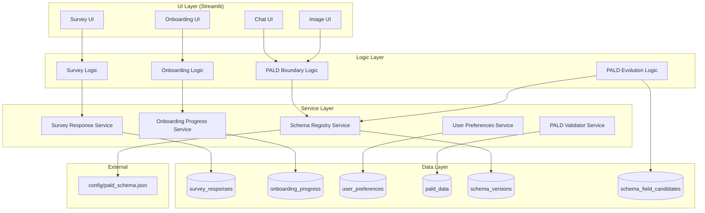
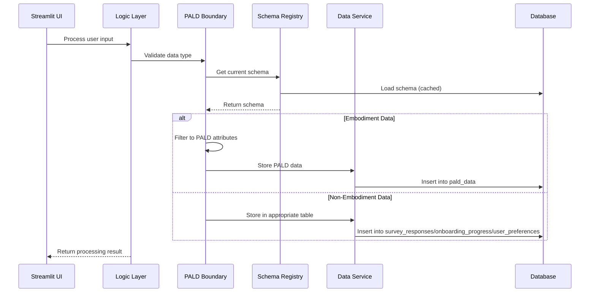

# PALD Boundary Enforcement and Schema Evolution - Design Document

## 1. High-Level Design

### 1.1 Architecture Overview



### 1.2 Data Flow Architecture



## 2. Component Design

### 2.1 PALD Boundary Logic (`src/logic/pald_boundary.py`)

```python
class PALDBoundaryEnforcer:
    """Enforces PALD boundaries and validates embodiment-only data."""
    
    def __init__(self, schema_registry: PALDSchemaRegistryService):
        self.schema_registry = schema_registry
        self._embodiment_deny_list = self._build_deny_list()
    
    def filter_to_pald_attributes(self, data: dict[str, Any]) -> dict[str, Any]:
        """Filter input data to only PALD-valid embodiment attributes."""
        
    def validate_pald_boundary(self, data: dict[str, Any]) -> PALDBoundaryResult:
        """Validate that data contains only embodiment-related attributes."""
        
    def is_embodiment_data(self, data: dict[str, Any]) -> bool:
        """Determine if data represents embodiment description/image."""
        
    def get_embodiment_deny_list(self) -> list[str]:
        """Get list of non-embodiment keys that should be rejected."""
        
    def _build_deny_list(self) -> set[str]:
        """Build comprehensive deny list for non-embodiment attributes."""
        return {
            # Survey-related keys
            "survey_completed_at", "survey_version", "survey_skipped",
            "learning_preferences", "interaction_style", "subject_areas",
            "goals", "privacy", "survey_metadata",
            
            # Onboarding-related keys  
            "onboarding_completed_at", "completion_version", "all_steps_completed",
            "step", "step_data", "step_completed", "onboarding_data",
            
            # User preference keys
            "personalization_level", "data_sharing_comfort", "notification_preferences",
            "ui_preferences", "accessibility_settings",
            
            # System metadata keys
            "data_type", "collected_at", "processing_metadata", "session_metadata"
        }

@dataclass
class PALDBoundaryResult:
    """Result of PALD boundary validation."""
    is_valid: bool
    filtered_data: dict[str, Any]
    rejected_keys: list[str]
    validation_errors: list[str]
    embodiment_detected: bool
```

### 2.2 PALD Evolution Logic (`src/logic/pald_evolution.py`)

```python
class PALDEvolutionManager:
    """Manages PALD schema evolution and candidate field detection."""
    
    def __init__(self, schema_registry: PALDSchemaRegistryService):
        self.schema_registry = schema_registry
    
    def extract_candidate_fields(
        self, 
        data: dict[str, Any], 
        current_schema: dict[str, Any]
    ) -> list[FieldCandidate]:
        """Extract fields that don't exist in current schema."""
        
    def harvest_schema_candidates(self, candidates: list[FieldCandidate]) -> None:
        """Store field candidates for governance review."""
        
    def propose_schema_changes(self, candidates: list[FieldCandidate]) -> list[SchemaChange]:
        """Propose schema changes based on candidate analysis."""
        
    def approve_candidate(self, candidate_id: UUID) -> None:
        """Approve a field candidate for schema integration."""
        
    def reject_candidate(self, candidate_id: UUID, reason: str) -> None:
        """Reject a field candidate with reason."""

@dataclass
class FieldCandidate:
    """Represents a candidate field for schema evolution."""
    field_name: str
    field_path: str
    detection_context: str
    occurrence_count: int
    example_values: list[Any]
    proposed_type: str
    confidence_score: float
```

### 2.3 Schema Registry Service (`src/services/pald_schema_registry_service.py`)

```python
class PALDSchemaRegistryService:
    """Service for managing PALD schema loading, caching, and versioning."""
    
    def __init__(self, db_session: Session, config: Config):
        self.db_session = db_session
        self.config = config
        self._schema_cache: dict[str, Any] = {}
        self._cache_timestamps: dict[str, float] = {}
    
    def get_active_schema(self) -> tuple[str, dict[str, Any]]:
        """Get the currently active PALD schema with caching."""
        
    def load_schema_from_file(self, file_path: str) -> dict[str, Any]:
        """Load schema from external JSON file with validation."""
        
    def validate_schema_structure(self, schema: dict[str, Any]) -> ValidationResult:
        """Validate schema structure and content."""
        
    def cache_schema(self, version: str, schema: dict[str, Any]) -> None:
        """Cache schema with TTL and modification detection."""
        
    def get_schema_checksum(self, schema: dict[str, Any]) -> str:
        """Calculate schema checksum for integrity verification."""
        
    def detect_schema_file_changes(self, file_path: str) -> bool:
        """Detect if schema file has been modified since last load."""
        
    def get_fallback_schema(self) -> dict[str, Any]:
        """Return embedded fallback schema if file loading fails."""
```

### 2.4 Data Services

#### Survey Response Service (`src/services/survey_response_service.py`)

```python
class SurveyResponseService:
    """Service for managing survey response data."""
    
    def __init__(self, db_session: Session):
        self.db_session = db_session
    
    def save_survey_response(
        self, 
        user_id: UUID, 
        survey_data: dict[str, Any]
    ) -> SurveyResponse:
        """Save user survey response data."""
        
    def get_user_survey_data(self, user_id: UUID) -> SurveyResponse | None:
        """Retrieve user's survey response data."""
        
    def update_survey_response(
        self, 
        user_id: UUID, 
        updates: dict[str, Any]
    ) -> SurveyResponse:
        """Update existing survey response."""
```

#### Onboarding Progress Service (`src/services/onboarding_progress_service.py`)

```python
class OnboardingProgressService:
    """Service for managing onboarding workflow progress."""
    
    def __init__(self, db_session: Session):
        self.db_session = db_session
    
    def update_progress(
        self, 
        user_id: UUID, 
        step: str, 
        step_data: dict[str, Any]
    ) -> OnboardingProgress:
        """Update user's onboarding progress."""
        
    def get_user_progress(self, user_id: UUID) -> OnboardingProgress | None:
        """Get user's current onboarding progress."""
        
    def mark_step_completed(self, user_id: UUID, step: str) -> None:
        """Mark a specific onboarding step as completed."""
        
    def complete_onboarding(self, user_id: UUID) -> None:
        """Mark onboarding as fully completed."""
```

#### User Preferences Service (`src/services/user_preferences_service.py`)

```python
class UserPreferencesService:
    """Service for managing user preference data."""
    
    def __init__(self, db_session: Session):
        self.db_session = db_session
    
    def save_preferences(
        self, 
        user_id: UUID, 
        preferences: dict[str, Any]
    ) -> UserPreferences:
        """Save user preference data."""
        
    def get_user_preferences(self, user_id: UUID) -> UserPreferences | None:
        """Retrieve user's preferences."""
        
    def update_preferences(
        self, 
        user_id: UUID, 
        updates: dict[str, Any]
    ) -> UserPreferences:
        """Update user preferences."""
```

## 3. Data Model Design

### 3.1 New Data Models

```python
class SurveyResponse(Base):
    """Survey response data model."""
    __tablename__ = "survey_responses"
    
    id = Column(PostgresUUID(as_uuid=True), primary_key=True, default=uuid4)
    user_id = Column(PostgresUUID(as_uuid=True), ForeignKey("users.id"), nullable=False)
    survey_data = Column(JSONColumn, nullable=False)
    survey_version = Column(String(50), nullable=False)
    completed_at = Column(DateTime, nullable=False, default=func.now())
    updated_at = Column(DateTime, nullable=False, default=func.now(), onupdate=func.now())
    
    __table_args__ = (
        Index("idx_survey_user", "user_id"),
        Index("idx_survey_completed", "completed_at"),
    )

class OnboardingProgress(Base):
    """Onboarding progress tracking model."""
    __tablename__ = "onboarding_progress"
    
    id = Column(PostgresUUID(as_uuid=True), primary_key=True, default=uuid4)
    user_id = Column(PostgresUUID(as_uuid=True), ForeignKey("users.id"), nullable=False)
    current_step = Column(String(100), nullable=False)
    completed_steps = Column(JSONColumn, nullable=False, default=list)
    step_data = Column(JSONColumn, nullable=True)
    progress_percentage = Column(Float, nullable=False, default=0.0)
    started_at = Column(DateTime, nullable=False, default=func.now())
    completed_at = Column(DateTime, nullable=True)
    updated_at = Column(DateTime, nullable=False, default=func.now(), onupdate=func.now())
    
    __table_args__ = (
        Index("idx_onboarding_user", "user_id"),
        Index("idx_onboarding_step", "current_step"),
    )

class UserPreferences(Base):
    """User preferences model."""
    __tablename__ = "user_preferences"
    
    id = Column(PostgresUUID(as_uuid=True), primary_key=True, default=uuid4)
    user_id = Column(PostgresUUID(as_uuid=True), ForeignKey("users.id"), nullable=False)
    preferences = Column(JSONColumn, nullable=False)
    category = Column(String(100), nullable=False)  # ui, privacy, personalization, etc.
    created_at = Column(DateTime, nullable=False, default=func.now())
    updated_at = Column(DateTime, nullable=False, default=func.now(), onupdate=func.now())
    
    __table_args__ = (
        Index("idx_preferences_user", "user_id"),
        Index("idx_preferences_category", "category"),
    )

class SchemaVersion(Base):
    """Schema version tracking model."""
    __tablename__ = "schema_versions"
    
    id = Column(PostgresUUID(as_uuid=True), primary_key=True, default=uuid4)
    version = Column(String(50), unique=True, nullable=False)
    schema_content = Column(JSONColumn, nullable=False)
    checksum = Column(String(64), nullable=False)
    file_path = Column(String(500), nullable=True)
    is_active = Column(Boolean, nullable=False, default=False)
    created_at = Column(DateTime, nullable=False, default=func.now())
    
    __table_args__ = (
        Index("idx_schema_version", "version"),
        Index("idx_schema_active", "is_active"),
    )

class SchemaFieldCandidate(Base):
    """Schema field candidate model."""
    __tablename__ = "schema_field_candidates"
    
    id = Column(PostgresUUID(as_uuid=True), primary_key=True, default=uuid4)
    field_name = Column(String(255), nullable=False)
    field_path = Column(String(500), nullable=False)
    detection_context = Column(Text, nullable=True)
    occurrence_count = Column(Integer, nullable=False, default=1)
    example_values = Column(JSONColumn, nullable=True)
    proposed_type = Column(String(100), nullable=True)
    confidence_score = Column(Float, nullable=True)
    review_status = Column(String(50), nullable=False, default="pending")
    approved_at = Column(DateTime, nullable=True)
    rejected_at = Column(DateTime, nullable=True)
    rejection_reason = Column(Text, nullable=True)
    created_at = Column(DateTime, nullable=False, default=func.now())
    updated_at = Column(DateTime, nullable=False, default=func.now(), onupdate=func.now())
    
    __table_args__ = (
        Index("idx_candidate_field", "field_name"),
        Index("idx_candidate_status", "review_status"),
        Index("idx_candidate_count", "occurrence_count"),
    )
```

## 4. Migration Design

### 4.1 Migration Strategy

```python
class PALDBoundaryMigration:
    """Handles migration of mixed PALD data to separated tables."""
    
    def __init__(self, db_session: Session):
        self.db_session = db_session
        self.boundary_enforcer = PALDBoundaryEnforcer()
    
    def analyze_existing_data(self) -> MigrationAnalysis:
        """Analyze existing PALD data for migration planning."""
        
    def execute_forward_migration(self) -> MigrationResult:
        """Execute forward migration to separate data."""
        
    def execute_rollback_migration(self) -> MigrationResult:
        """Execute rollback migration to restore original state."""
        
    def validate_migration_integrity(self) -> ValidationResult:
        """Validate migration completed successfully."""

@dataclass
class MigrationAnalysis:
    """Analysis of data requiring migration."""
    total_records: int
    embodiment_records: int
    survey_records: int
    onboarding_records: int
    preference_records: int
    mixed_records: int
    estimated_duration: timedelta

@dataclass
class MigrationResult:
    """Result of migration operation."""
    success: bool
    records_processed: int
    records_migrated: int
    errors: list[str]
    duration: timedelta
    rollback_available: bool
```

### 4.2 Migration Steps

1. **Pre-Migration Analysis**
   - Scan all `pald_data` records
   - Classify data types (embodiment vs non-embodiment)
   - Estimate migration complexity and duration
   - Create backup of current state

2. **Data Separation Phase**
   - Extract survey data from `pald_content`
   - Extract onboarding metadata from `pald_content`
   - Extract user preferences from `pald_content`
   - Preserve embodiment-only data in `pald_content`

3. **Data Migration Phase**
   - Insert survey data into `survey_responses`
   - Insert onboarding data into `onboarding_progress`
   - Insert preferences into `user_preferences`
   - Update `pald_data` with cleaned content

4. **Validation Phase**
   - Verify all data migrated correctly
   - Validate referential integrity
   - Confirm no data loss occurred
   - Test boundary enforcement on migrated data

5. **Cleanup Phase**
   - Remove temporary migration tables
   - Update schema version tracking
   - Log migration completion
   - Enable boundary enforcement

## 5. Configuration Design

### 5.1 Centralized Configuration

```python
@dataclass
class PALDBoundaryConfig:
    """Configuration for PALD boundary enforcement."""
    
    # Core boundary settings
    mandatory_pald_extraction: bool = True
    pald_analysis_deferred: bool = True
    enable_bias_analysis: bool = True
    enable_pald_auto_extension: bool = False
    
    # Schema management
    pald_schema_file_path: str = "config/pald_schema.json"
    pald_schema_cache_ttl: int = 300  # 5 minutes
    pald_schema_checksum_log: bool = True
    
    # Candidate harvesting
    pald_candidate_min_support: int = 5
    enable_candidate_harvesting: bool = True
    candidate_review_required: bool = True
    
    # Migration settings
    migration_batch_size: int = 100
    migration_timeout_minutes: int = 60
    enable_migration_rollback: bool = True
    
    def validate(self) -> list[str]:
        """Validate configuration settings."""
        errors = []
        
        if not self.mandatory_pald_extraction:
            errors.append("mandatory_pald_extraction must always be True")
            
        if not Path(self.pald_schema_file_path).exists():
            errors.append(f"Schema file not found: {self.pald_schema_file_path}")
            
        return errors
```

### 5.2 Environment Variable Overrides

```bash
# Core settings
MANDATORY_PALD_EXTRACTION=true
PALD_ANALYSIS_DEFERRED=true
ENABLE_BIAS_ANALYSIS=true

# Schema settings  
PALD_SCHEMA_FILE_PATH=config/pald_schema.json
PALD_SCHEMA_CACHE_TTL=300
PALD_SCHEMA_CHECKSUM_LOG=true

# Evolution settings
ENABLE_PALD_AUTO_EXTENSION=false
PALD_CANDIDATE_MIN_SUPPORT=5
```

## 6. Error Handling Design

### 6.1 Error Hierarchy

```python
class PALDBoundaryError(Exception):
    """Base exception for PALD boundary errors."""
    pass

class PALDBoundaryViolationError(PALDBoundaryError):
    """Exception for boundary validation failures."""
    pass

class PALDSchemaLoadError(PALDBoundaryError):
    """Exception for schema loading failures."""
    pass

class PALDMigrationError(PALDBoundaryError):
    """Exception for migration failures."""
    pass

class PALDEvolutionError(PALDBoundaryError):
    """Exception for schema evolution failures."""
    pass
```

### 6.2 Recovery Strategies

```python
class PALDErrorRecoveryManager:
    """Manages error recovery for PALD boundary operations."""
    
    def handle_schema_load_failure(self, error: PALDSchemaLoadError) -> dict[str, Any]:
        """Fallback to embedded schema on load failure."""
        
    def handle_boundary_violation(self, error: PALDBoundaryViolationError) -> None:
        """Log violation and provide user guidance."""
        
    def handle_migration_failure(self, error: PALDMigrationError) -> None:
        """Initiate rollback on migration failure."""
        
    def handle_evolution_failure(self, error: PALDEvolutionError) -> None:
        """Graceful degradation for evolution failures."""
```

## 7. Testing Strategy

### 7.1 Unit Testing

```python
class TestPALDBoundaryEnforcement:
    """Test PALD boundary enforcement logic."""
    
    def test_filter_embodiment_data(self):
        """Test filtering to embodiment-only attributes."""
        
    def test_reject_survey_data(self):
        """Test rejection of survey data from PALD."""
        
    def test_reject_onboarding_data(self):
        """Test rejection of onboarding metadata from PALD."""
        
    def test_boundary_validation_errors(self):
        """Test boundary validation error messages."""

class TestSchemaEvolution:
    """Test schema evolution functionality."""
    
    def test_candidate_field_detection(self):
        """Test detection of out-of-schema fields."""
        
    def test_candidate_harvesting(self):
        """Test harvesting of field candidates."""
        
    def test_schema_governance(self):
        """Test candidate approval/rejection workflow."""
```

### 7.2 Integration Testing

```python
class TestPALDBoundaryIntegration:
    """Test PALD boundary integration with existing system."""
    
    def test_survey_ui_no_pald_writes(self):
        """Test survey UI doesn't write to PALD."""
        
    def test_onboarding_metadata_separation(self):
        """Test onboarding metadata goes to correct table."""
        
    def test_embodiment_data_pald_writes(self):
        """Test embodiment data still writes to PALD."""
        
    def test_migration_data_integrity(self):
        """Test migration preserves all data."""
```

### 7.3 Contract Testing

```python
class TestPALDServiceContracts:
    """Test service layer contracts."""
    
    def test_schema_registry_contract(self):
        """Test schema registry service contract."""
        
    def test_survey_service_contract(self):
        """Test survey response service contract."""
        
    def test_boundary_enforcer_contract(self):
        """Test boundary enforcer contract."""
```

## 8. Performance Considerations

### 8.1 Optimization Strategies

1. **Schema Caching**: Cache loaded schemas with TTL and modification detection
2. **Boundary Validation**: Pre-compile deny lists and use set operations
3. **Migration Batching**: Process migration in configurable batches
4. **Database Indexing**: Add appropriate indexes for new tables
5. **Connection Pooling**: Reuse database connections for migration

### 8.2 Monitoring and Metrics

```python
class PALDBoundaryMetrics:
    """Metrics collection for PALD boundary operations."""
    
    def track_boundary_validation_time(self, duration: float):
        """Track boundary validation performance."""
        
    def track_schema_load_time(self, duration: float):
        """Track schema loading performance."""
        
    def track_migration_progress(self, processed: int, total: int):
        """Track migration progress."""
        
    def track_boundary_violations(self, violation_type: str):
        """Track boundary violation occurrences."""
```

## 9. Security and Privacy

### 9.1 Data Protection

1. **Pseudonymization**: Maintain existing user pseudonymization
2. **Access Controls**: Preserve existing role-based access
3. **Encryption**: Maintain existing encryption for sensitive data
4. **Audit Logging**: Log all boundary enforcement actions

### 9.2 Privacy Compliance

```python
class PALDPrivacyManager:
    """Manages privacy compliance for PALD boundary operations."""
    
    def anonymize_candidate_data(self, candidates: list[FieldCandidate]) -> list[FieldCandidate]:
        """Remove personally identifiable information from candidates."""
        
    def validate_data_retention(self, data_age: timedelta) -> bool:
        """Check data retention policy compliance."""
        
    def handle_deletion_request(self, user_id: UUID) -> None:
        """Handle user data deletion requests."""
```

This design provides a comprehensive architecture for implementing PALD boundary enforcement while maintaining system integrity, performance, and privacy requirements.