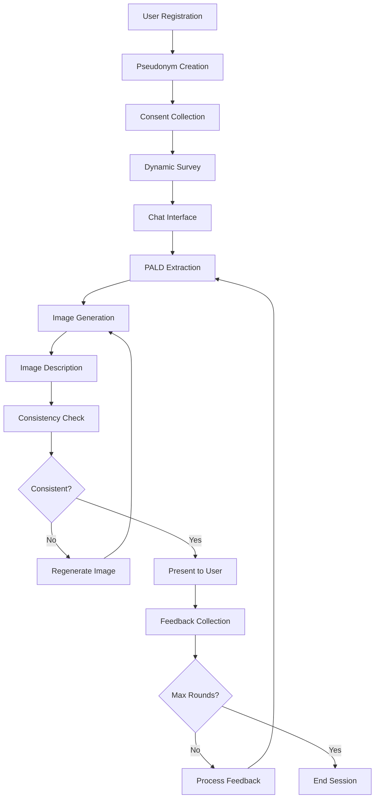

# Design Document

## Overview

The Study Participation and Onboarding Flow is designed as a comprehensive research data collection system that integrates seamlessly with the existing GITTE architecture. The system implements a pseudonym-based identity management approach where all research data is collected and stored under anonymized identifiers, ensuring participant privacy while maintaining data integrity for research purposes.

The design follows a sequential flow: Registration → Pseudonym Creation → Consent Collection → Dynamic Survey → Chat Interface with PALD Pipeline → Feedback Loops. Each step is mandatory and builds upon the previous, ensuring complete data collection and proper research protocol adherence.

## Architecture

### High-Level Architecture

The system maintains the existing 4-layer GITTE architecture:

```
┌─────────────────────────────────────────────────────────────┐
│                        UI Layer                             │
│  study_participation_ui.py │ survey_ui.py │ chat_ui.py     │
└─────────────────────────────────────────────────────────────┘
                                │
┌─────────────────────────────────────────────────────────────┐
│                      Logic Layer                            │
│  onboarding_logic.py │ survey_logic.py │ chat_logic.py     │
│  pseudonym_logic.py │ consent_logic.py │ pald_logic.py     │
└─────────────────────────────────────────────────────────────┘
                                │
┌─────────────────────────────────────────────────────────────┐
│                     Service Layer                           │
│  pseudonym_service.py │ consent_service.py │ survey_service.py │
│  chat_service.py │ pald_service.py │ admin_service.py      │
└─────────────────────────────────────────────────────────────┘
                                │
┌─────────────────────────────────────────────────────────────┐
│                      Data Layer                             │
│  models.py │ repositories.py │ migrations/                 │
└─────────────────────────────────────────────────────────────┘
```

### Data Flow Architecture



## Components and Interfaces

### 1. Pseudonym Management Component

**Purpose**: Creates and manages anonymized participant identifiers

**Interfaces**:
```python
# Logic Layer
class PseudonymLogic:
    def create_pseudonym(self, user_id: UUID, pseudonym_text: str) -> PseudonymResult
    def validate_pseudonym_uniqueness(self, pseudonym_text: str) -> bool
    def get_pseudonym_by_user(self, user_id: UUID) -> Pseudonym | None
    def generate_pseudonym_hash(self, pseudonym_text: str) -> str

# Service Layer  
class PseudonymService:
    def store_pseudonym(self, pseudonym: Pseudonym) -> bool
    def check_pseudonym_exists(self, pseudonym_text: str) -> bool
    def retrieve_pseudonym(self, pseudonym_id: UUID) -> Pseudonym | None
```

**Key Design Decisions**:
- Pseudonym combines user-provided text with system-generated hash
- Pseudonym becomes the primary key for all subsequent data
- Separation between user_id (authentication) and pseudonym_id (research data)

### 2. Consent Management Component

**Purpose**: Collects and manages multi-step consent for research participation

**Interfaces**:
```python
# Logic Layer
class ConsentLogic:
    def validate_consent_completeness(self, consents: List[ConsentType]) -> ValidationResult
    def process_consent_collection(self, pseudonym_id: UUID, consents: Dict[str, bool]) -> ConsentResult
    def check_consent_status(self, pseudonym_id: UUID) -> ConsentStatus

# Service Layer
class ConsentService:
    def store_consent(self, pseudonym_id: UUID, consent_type: str, granted: bool) -> bool
    def get_consent_status(self, pseudonym_id: UUID) -> Dict[str, ConsentRecord]
    def revoke_consent(self, pseudonym_id: UUID, consent_type: str) -> bool
```

**Consent Types**:
- `data_protection`: GDPR compliance and data handling
- `ai_interaction`: AI processing of participant input
- `study_participation`: Research data collection and analysis

### 3. Dynamic Survey Component

**Purpose**: Loads and processes surveys from external Excel/CSV files

**Interfaces**:
```python
# Logic Layer
class SurveyLogic:
    def load_survey_definition(self, survey_file_path: str) -> SurveyDefinition
    def validate_survey_responses(self, responses: Dict[str, Any], definition: SurveyDefinition) -> ValidationResult
    def process_survey_submission(self, pseudonym_id: UUID, responses: Dict[str, Any]) -> SurveyResult

# Service Layer
class SurveyService:
    def parse_survey_file(self, file_path: str) -> List[SurveyQuestion]
    def store_survey_responses(self, pseudonym_id: UUID, responses: Dict[str, Any]) -> bool
    def get_survey_responses(self, pseudonym_id: UUID) -> SurveyResponse | None
```

**Survey Schema**:
```python
@dataclass
class SurveyQuestion:
    question_id: str
    question_text: str
    type: Literal["text", "number", "choice", "multi-choice"]
    options: List[str] | None
    required: bool
```

### 4. Chat and PALD Pipeline Component

**Purpose**: Manages chat interactions with integrated PALD processing and consistency checking

**Interfaces**:
```python
# Logic Layer
class ChatLogic:
    def process_chat_input(self, pseudonym_id: UUID, message: str) -> ChatResult
    def extract_pald_from_input(self, message: str) -> PALDData
    def check_pald_consistency(self, input_pald: PALDData, description_pald: PALDData) -> ConsistencyResult
    def manage_feedback_loop(self, pseudonym_id: UUID, feedback: str, round_number: int) -> FeedbackResult

# Service Layer
class ChatService:
    def store_chat_message(self, pseudonym_id: UUID, message: ChatMessage) -> bool
    def get_chat_history(self, pseudonym_id: UUID) -> List[ChatMessage]
    def store_pald_data(self, pseudonym_id: UUID, pald: PALDData) -> bool
    def log_interaction_metadata(self, pseudonym_id: UUID, metadata: InteractionMetadata) -> bool
```

### 5. Image Generation and Processing Component

**Purpose**: Generates images from PALD data and manages the consistency loop

**Interfaces**:
```python
# Logic Layer
class ImageGenerationLogic:
    def generate_image_from_pald(self, pald_data: PALDData) -> ImageResult
    def describe_generated_image(self, image_path: str) -> ImageDescription
    def compress_pald_to_prompt(self, pald_data: PALDData) -> str

# Service Layer
class ImageGenerationService:
    def call_stable_diffusion(self, prompt: str, parameters: Dict[str, Any]) -> GeneratedImage
    def call_image_description_llm(self, image_path: str) -> str
    def store_generated_image(self, pseudonym_id: UUID, image: GeneratedImage) -> str
```

### 6. Admin and Database Management Component

**Purpose**: Provides administrative functions for database management and study reset

**Interfaces**:
```python
# Logic Layer
class AdminLogic:
    def initialize_database_schema(self) -> InitializationResult
    def reset_all_study_data(self) -> ResetResult
    def validate_database_integrity(self) -> ValidationResult

# Service Layer
class AdminService:
    def create_all_tables(self) -> bool
    def drop_all_tables(self) -> bool
    def verify_foreign_key_constraints(self) -> List[ConstraintViolation]
    def export_study_data(self, pseudonym_id: UUID | None = None) -> ExportResult
```

## Data Models

### Core Data Models

```python
# Pseudonym Management
@dataclass
class Pseudonym:
    pseudonym_id: UUID
    user_id: UUID  # Link to authentication system
    pseudonym_text: str
    pseudonym_hash: str
    created_at: datetime
    is_active: bool

# Consent Management
@dataclass
class ConsentRecord:
    consent_id: UUID
    pseudonym_id: UUID
    consent_type: str
    granted: bool
    version: str
    granted_at: datetime
    revoked_at: datetime | None

# Survey System
@dataclass
class SurveyResponse:
    response_id: UUID
    pseudonym_id: UUID
    survey_version: str
    responses: Dict[str, Any]  # JSON field
    completed_at: datetime
    
@dataclass
class SurveyQuestion:
    question_id: str
    question_text: str
    type: str
    options: List[str] | None
    required: bool

# Chat and PALD System
@dataclass
class ChatMessage:
    message_id: UUID
    pseudonym_id: UUID
    session_id: UUID
    message_type: Literal["user", "assistant", "system"]
    content: str
    pald_data: Dict[str, Any] | None
    timestamp: datetime
    
@dataclass
class PALDData:
    pald_id: UUID
    pseudonym_id: UUID
    session_id: UUID
    pald_content: Dict[str, Any]
    pald_type: Literal["input", "description", "feedback"]
    consistency_score: float | None
    created_at: datetime

# Image Generation
@dataclass
class GeneratedImage:
    image_id: UUID
    pseudonym_id: UUID
    session_id: UUID
    image_path: str
    prompt: str
    pald_source_id: UUID
    generation_parameters: Dict[str, Any]
    created_at: datetime

# Feedback System
@dataclass
class FeedbackRecord:
    feedback_id: UUID
    pseudonym_id: UUID
    session_id: UUID
    image_id: UUID
    feedback_text: str
    feedback_pald: Dict[str, Any] | None
    round_number: int
    created_at: datetime

# Interaction Logging
@dataclass
class InteractionLog:
    log_id: UUID
    pseudonym_id: UUID
    session_id: UUID
    interaction_type: str
    prompt: str | None
    response: str | None
    model_used: str
    parameters: Dict[str, Any]
    token_usage: Dict[str, int] | None
    latency_ms: int
    timestamp: datetime
```

### Database Schema

```sql
-- Core Tables
CREATE TABLE pseudonyms (
    pseudonym_id UUID PRIMARY KEY,
    user_id UUID NOT NULL REFERENCES users(user_id),
    pseudonym_text VARCHAR(255) UNIQUE NOT NULL,
    pseudonym_hash VARCHAR(255) NOT NULL,
    created_at TIMESTAMP DEFAULT NOW(),
    is_active BOOLEAN DEFAULT TRUE
);

CREATE TABLE consent_records (
    consent_id UUID PRIMARY KEY,
    pseudonym_id UUID NOT NULL REFERENCES pseudonyms(pseudonym_id) ON DELETE CASCADE,
    consent_type VARCHAR(50) NOT NULL,
    granted BOOLEAN NOT NULL,
    version VARCHAR(20) NOT NULL,
    granted_at TIMESTAMP DEFAULT NOW(),
    revoked_at TIMESTAMP NULL
);

CREATE TABLE survey_responses (
    response_id UUID PRIMARY KEY,
    pseudonym_id UUID NOT NULL REFERENCES pseudonyms(pseudonym_id) ON DELETE CASCADE,
    survey_version VARCHAR(20) NOT NULL,
    responses JSONB NOT NULL,
    completed_at TIMESTAMP DEFAULT NOW()
);

CREATE TABLE chat_messages (
    message_id UUID PRIMARY KEY,
    pseudonym_id UUID NOT NULL REFERENCES pseudonyms(pseudonym_id) ON DELETE CASCADE,
    session_id UUID NOT NULL,
    message_type VARCHAR(20) NOT NULL,
    content TEXT NOT NULL,
    pald_data JSONB NULL,
    timestamp TIMESTAMP DEFAULT NOW()
);

CREATE TABLE pald_data (
    pald_id UUID PRIMARY KEY,
    pseudonym_id UUID NOT NULL REFERENCES pseudonyms(pseudonym_id) ON DELETE CASCADE,
    session_id UUID NOT NULL,
    pald_content JSONB NOT NULL,
    pald_type VARCHAR(20) NOT NULL,
    consistency_score FLOAT NULL,
    created_at TIMESTAMP DEFAULT NOW()
);

CREATE TABLE generated_images (
    image_id UUID PRIMARY KEY,
    pseudonym_id UUID NOT NULL REFERENCES pseudonyms(pseudonym_id) ON DELETE CASCADE,
    session_id UUID NOT NULL,
    image_path VARCHAR(500) NOT NULL,
    prompt TEXT NOT NULL,
    pald_source_id UUID REFERENCES pald_data(pald_id),
    generation_parameters JSONB NOT NULL,
    created_at TIMESTAMP DEFAULT NOW()
);

CREATE TABLE feedback_records (
    feedback_id UUID PRIMARY KEY,
    pseudonym_id UUID NOT NULL REFERENCES pseudonyms(pseudonym_id) ON DELETE CASCADE,
    session_id UUID NOT NULL,
    image_id UUID REFERENCES generated_images(image_id),
    feedback_text TEXT NOT NULL,
    feedback_pald JSONB NULL,
    round_number INTEGER NOT NULL,
    created_at TIMESTAMP DEFAULT NOW()
);

CREATE TABLE interaction_logs (
    log_id UUID PRIMARY KEY,
    pseudonym_id UUID NOT NULL REFERENCES pseudonyms(pseudonym_id) ON DELETE CASCADE,
    session_id UUID NOT NULL,
    interaction_type VARCHAR(50) NOT NULL,
    prompt TEXT NULL,
    response TEXT NULL,
    model_used VARCHAR(100) NOT NULL,
    parameters JSONB NOT NULL,
    token_usage JSONB NULL,
    latency_ms INTEGER NOT NULL,
    timestamp TIMESTAMP DEFAULT NOW()
);
```

## Error Handling

### Error Categories and Strategies

1. **Pseudonym Creation Errors**
   - Duplicate pseudonym: Prompt user to choose different text
   - Hash generation failure: Retry with different salt
   - Database storage failure: Rollback and retry

2. **Consent Collection Errors**
   - Incomplete consent: Block progression with clear messaging
   - Storage failure: Retry with exponential backoff
   - Consent withdrawal: Immediate data processing halt

3. **Survey Loading Errors**
   - File not found: Fall back to default survey or admin notification
   - Invalid format: Log error and use backup survey
   - Validation failure: Highlight specific issues to user

4. **PALD Processing Errors**
   - Extraction failure: Log error and continue with minimal PALD
   - Consistency check failure: Use timeout and proceed
   - Storage failure: Retry with circuit breaker pattern

5. **Image Generation Errors**
   - Model unavailable: Fall back to dummy mode or queue for later
   - Generation timeout: Retry with reduced parameters
   - Storage failure: Keep in memory and retry storage

### Error Recovery Mechanisms

```python
@dataclass
class ErrorRecoveryConfig:
    max_retries: int = 3
    backoff_multiplier: float = 2.0
    circuit_breaker_threshold: int = 5
    fallback_enabled: bool = True
    user_notification_required: bool = True

class ErrorHandler:
    def handle_with_retry(self, operation: Callable, config: ErrorRecoveryConfig) -> Result
    def circuit_breaker(self, service_name: str, operation: Callable) -> Result
    def fallback_strategy(self, error_type: str, context: Dict[str, Any]) -> FallbackResult
```

## Testing Strategy

### Unit Testing

1. **Pseudonym Logic Tests**
   - Uniqueness validation
   - Hash generation consistency
   - User-pseudonym mapping

2. **Consent Management Tests**
   - Multi-step consent validation
   - Consent withdrawal handling
   - Storage and retrieval accuracy

3. **Survey System Tests**
   - Dynamic loading from various file formats
   - Question type validation
   - Response processing and storage

4. **PALD Pipeline Tests**
   - Extraction accuracy
   - Consistency checking logic
   - Feedback loop management

### Integration Testing

1. **End-to-End Flow Tests**
   - Complete onboarding sequence
   - Data persistence across steps
   - Error recovery scenarios

2. **Database Integration Tests**
   - Foreign key constraint validation
   - Cascade deletion behavior
   - Transaction rollback scenarios

3. **External Service Integration Tests**
   - LLM service connectivity
   - Image generation pipeline
   - File system operations

### Performance Testing

1. **Load Testing**
   - Concurrent user onboarding
   - Database performance under load
   - Memory usage during PALD processing

2. **Latency Testing**
   - Response times for each step
   - Image generation performance
   - Database query optimization

### Contract Testing

1. **Service Interface Tests**
   - API contract validation
   - Data format consistency
   - Error response formats

2. **Database Schema Tests**
   - Migration script validation
   - Schema constraint verification
   - Data integrity checks

## Configuration Management

### Core Configuration Parameters

```python
# Study Flow Configuration
STUDY_PARTICIPATION_ENABLED: bool = True
PSEUDONYM_MIN_LENGTH: int = 3
PSEUDONYM_MAX_LENGTH: int = 50
REQUIRED_CONSENTS: List[str] = ["data_protection", "ai_interaction", "study_participation"]

# Survey Configuration
SURVEY_FILE_PATH: str = "config/study_survey.xlsx"
SURVEY_FALLBACK_ENABLED: bool = True
SURVEY_VALIDATION_STRICT: bool = True

# Chat and PALD Configuration
MAX_FEEDBACK_ROUNDS: int = 3
PALD_CONSISTENCY_THRESHOLD: float = 0.8
PALD_CONSISTENCY_MAX_ITERATIONS: int = 5
ENABLE_CONSISTENCY_CHECK: bool = True

# Image Generation Configuration
IMAGE_GENERATION_TIMEOUT: int = 30
IMAGE_PROMPT_MAX_TOKENS: int = 77
IMAGE_STORAGE_PATH: str = "generated_images/"

# Database Configuration
DATABASE_RESET_ENABLED: bool = False  # Safety flag
AUTO_MIGRATION_ENABLED: bool = True
FOREIGN_KEY_CHECKS_ENABLED: bool = True

# Logging Configuration
LOG_ALL_INTERACTIONS: bool = True
LOG_PALD_PROCESSING: bool = True
LOG_PERFORMANCE_METRICS: bool = True
AUDIT_TRAIL_ENABLED: bool = True
```

### Environment-Specific Overrides

```python
# Development Environment
if ENVIRONMENT == "development":
    DATABASE_RESET_ENABLED = True
    SURVEY_VALIDATION_STRICT = False
    MAX_FEEDBACK_ROUNDS = 1

# Testing Environment  
if ENVIRONMENT == "testing":
    PSEUDONYM_MIN_LENGTH = 1
    PALD_CONSISTENCY_MAX_ITERATIONS = 2
    IMAGE_GENERATION_TIMEOUT = 5

# Production Environment
if ENVIRONMENT == "production":
    DATABASE_RESET_ENABLED = False
    LOG_PERFORMANCE_METRICS = True
    AUDIT_TRAIL_ENABLED = True
```

This design provides a comprehensive foundation for implementing the study participation and onboarding flow while maintaining integration with the existing GITTE system architecture and ensuring research data integrity and participant privacy.