# GITTE Architecture Documentation

**Version:** 1.0  
**Date:** December 2024  
**Status:** Current

---

## Table of Contents

1. [Introduction and Goals](#1-introduction-and-goals)
2. [Architecture Constraints](#2-architecture-constraints)
3. [System Scope and Context](#3-system-scope-and-context)
4. [Solution Strategy](#4-solution-strategy)
5. [Building Block View](#5-building-block-view)
6. [Runtime View](#6-runtime-view)
7. [Deployment View](#7-deployment-view)
8. [Cross-cutting Concepts](#8-cross-cutting-concepts)
9. [Architecture Decisions](#9-architecture-decisions)
10. [Quality Requirements](#10-quality-requirements)
11. [Risks and Technical Debts](#11-risks-and-technical-debts)
12. [Glossary](#12-glossary)

---

## 1. Introduction and Goals

### 1.1 Requirements Overview

GITTE (Great Individual Tutor Embodiment) is a production-grade federated learning-capable system for creating personalized visual representations and embodiments of intelligent learning assistants.

**Key Features:**
- Personalized avatar generation and customization
- AI-powered chat interactions for embodiment design
- Privacy-preserving federated learning capabilities
- GDPR-compliant data management
- Comprehensive audit logging and monitoring

### 1.2 Quality Goals

| Priority | Quality Goal | Scenario |
|----------|-------------|----------|
| 1 | **Privacy & Security** | All user data processing requires explicit consent; GDPR compliance with 72-hour data deletion |
| 2 | **Performance** | LLM responses ≤2s median TTFT, image generation ≤30s p95 |
| 3 | **Maintainability** | Strict 4-layer architecture enables independent component development |
| 4 | **Scalability** | Horizontal scaling support for increased user load |
| 5 | **Reliability** | 99.5% uptime during business hours, comprehensive error handling |

### 1.3 Stakeholders

| Role | Contact | Expectations |
|------|---------|-------------|
| **End Users** | Learning platform users | Intuitive avatar creation, fast responses, privacy protection |
| **Administrators** | System operators | Monitoring tools, data export, user management |
| **Developers** | Development team | Clear architecture, comprehensive testing, documentation |
| **Compliance Officers** | Legal/Privacy team | GDPR compliance, audit trails, data protection |

---

## 2. Architecture Constraints

### 2.1 Technical Constraints

| Constraint | Background | Consequences |
|------------|------------|--------------|
| **Python 3.10+** | Team expertise, ecosystem | All components must be Python-compatible |
| **Streamlit UI** | Rapid prototyping requirement | UI layer limited to Streamlit capabilities |
| **PostgreSQL** | ACID compliance needs | Relational data modeling required |
| **Docker Deployment** | Containerization mandate | All services must be containerizable |

### 2.2 Organizational Constraints

| Constraint | Background | Consequences |
|------------|------------|--------------|
| **4-Layer Architecture** | Maintainability requirement | Strict layer separation enforced |
| **Privacy by Design** | GDPR compliance | All features must consider privacy implications |
| **Open Source Dependencies** | Licensing requirements | Commercial libraries avoided where possible |

### 2.3 Conventions

- **Code Style:** Black formatting, MyPy type checking
- **Testing:** Pytest with 85%+ coverage requirement
- **Documentation:** Arc42 architecture documentation
- **Versioning:** Semantic versioning (SemVer)
- **Git Workflow:** Trunk-based development with feature branches

---

## 3. System Scope and Context

### 3.1 Business Context

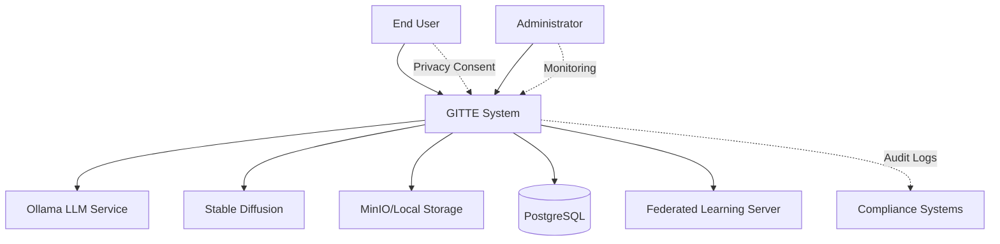

**External Interfaces:**

| Partner/User | Interface | Purpose |
|--------------|-----------|---------|
| **End Users** | Web UI (Streamlit) | Avatar creation, chat interactions |
| **Administrators** | Admin UI | System monitoring, data export |
| **Ollama Service** | HTTP API | LLM chat responses |
| **Stable Diffusion** | Python API | Image generation |
| **MinIO** | S3-compatible API | Object storage |
| **FL Server** | HTTP API | Federated learning coordination |

### 3.2 Technical Context

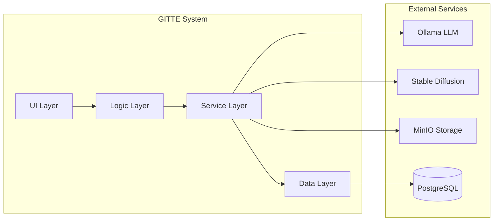

---

## 4. Solution Strategy

### 4.1 Technology Decisions

| Decision | Rationale | Alternatives Considered |
|----------|-----------|------------------------|
| **Streamlit** | Rapid UI development, Python integration | FastAPI + React, Django |
| **Ollama** | Local LLM deployment, privacy control | OpenAI API, Anthropic |
| **PostgreSQL** | ACID compliance, JSON support | MongoDB, SQLite |
| **Docker Compose** | Development simplicity | Kubernetes, bare metal |

### 4.2 Top-Level Decomposition

The system follows a strict **4-layer architecture**:

1. **UI Layer:** User interface and presentation logic
2. **Logic Layer:** Business rules and workflow orchestration
3. **Service Layer:** External service integration and data transformation
4. **Data Layer:** Persistence and data access

### 4.3 Quality Achievement

| Quality Goal | Solution Approach |
|--------------|------------------|
| **Privacy** | Consent gates, pseudonymization, local processing |
| **Performance** | Async processing, caching, streaming responses |
| **Maintainability** | Layer separation, dependency injection, comprehensive testing |
| **Scalability** | Stateless services, horizontal scaling, load balancing |

---

## 5. Building Block View

### 5.1 Level 1: System Overview

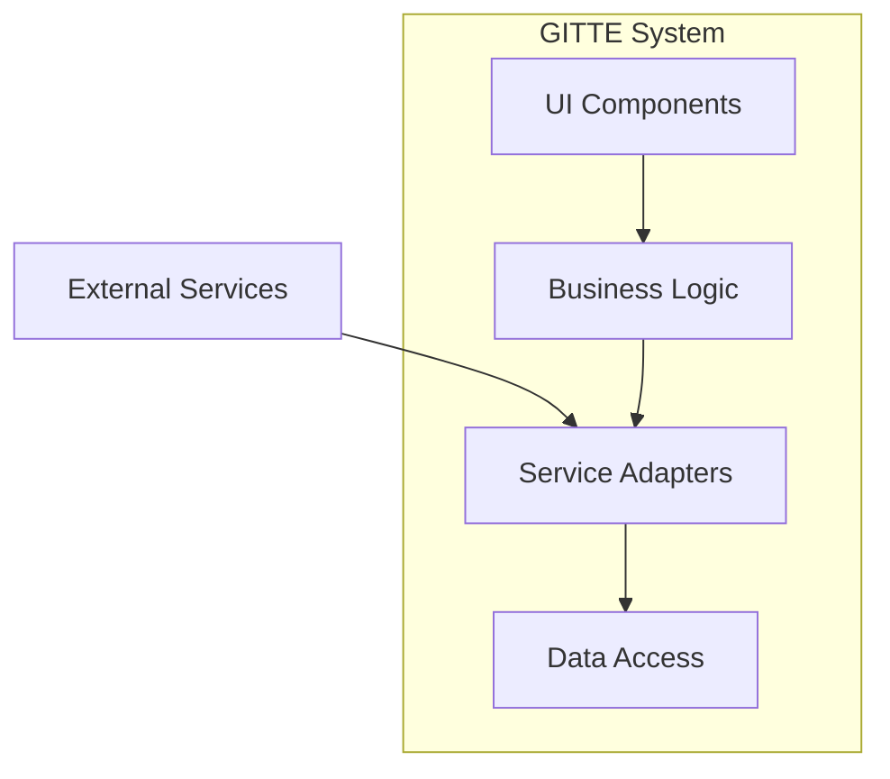

**Responsibilities:**
- **UI Components:** User interaction, display logic, input validation
- **Business Logic:** Workflow orchestration, business rules, decision making
- **Service Adapters:** External service integration, data transformation
- **Data Access:** Persistence, schema management, migrations

### 5.2 Level 2: UI Layer Detail

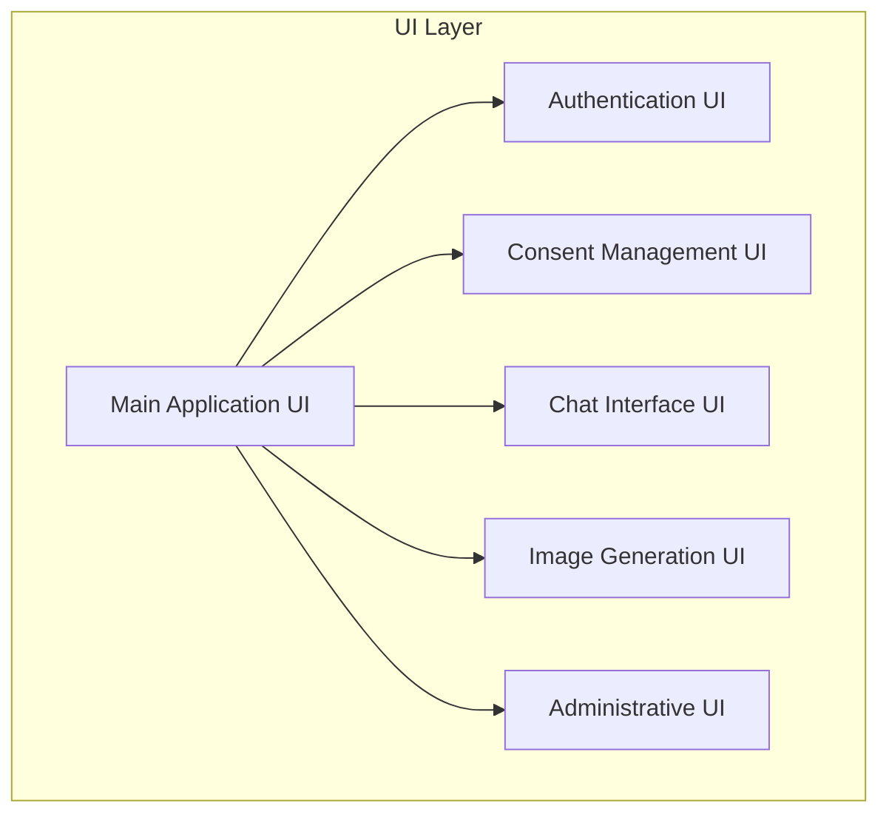

**Key Components:**
- **Authentication UI:** Login, registration, session management
- **Consent UI:** Privacy consent collection and management
- **Chat UI:** LLM interaction interface with streaming support
- **Image UI:** Avatar generation and customization interface
- **Admin UI:** System monitoring, user management, data export

### 5.3 Level 2: Logic Layer Detail

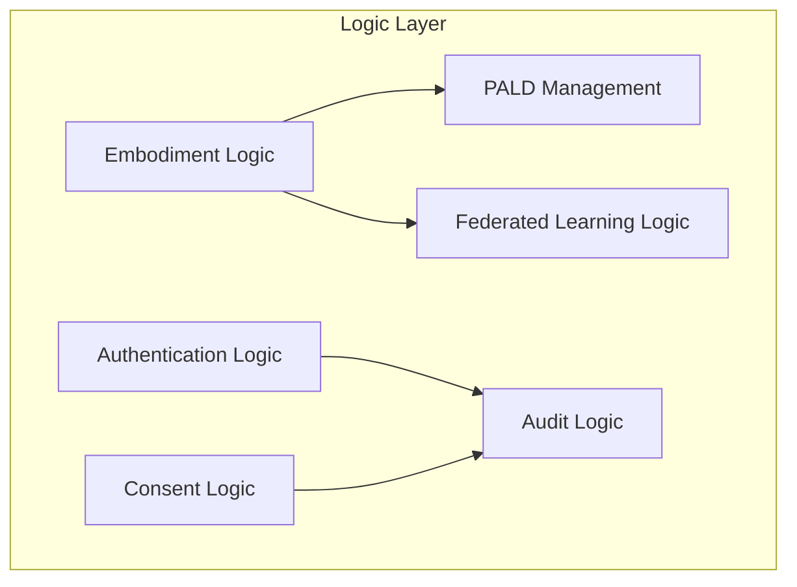

**Key Components:**
- **Authentication Logic:** User authentication, role management, session handling
- **Consent Logic:** Privacy consent workflow, GDPR compliance
- **Embodiment Logic:** Avatar personalization, interaction management
- **PALD Management:** Schema validation, coverage analysis, evolution
- **Federated Learning Logic:** Local model updates, privacy preservation
- **Audit Logic:** Comprehensive logging, compliance tracking

### 5.4 Level 2: Service Layer Detail

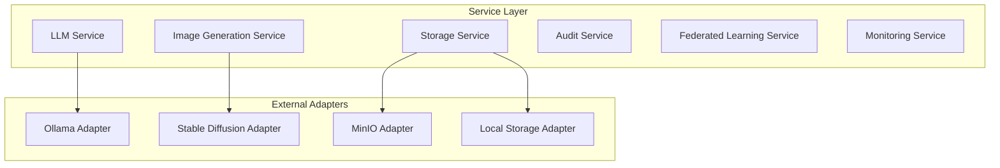

**Key Components:**
- **LLM Service:** Chat processing, model management, response streaming
- **Image Service:** Avatar generation, image processing, metadata management
- **Storage Service:** File storage abstraction, MinIO/local fallback
- **Audit Service:** Write-ahead logging, compliance tracking
- **Monitoring Service:** Health checks, metrics collection, alerting

### 5.5 Level 2: Data Layer Detail

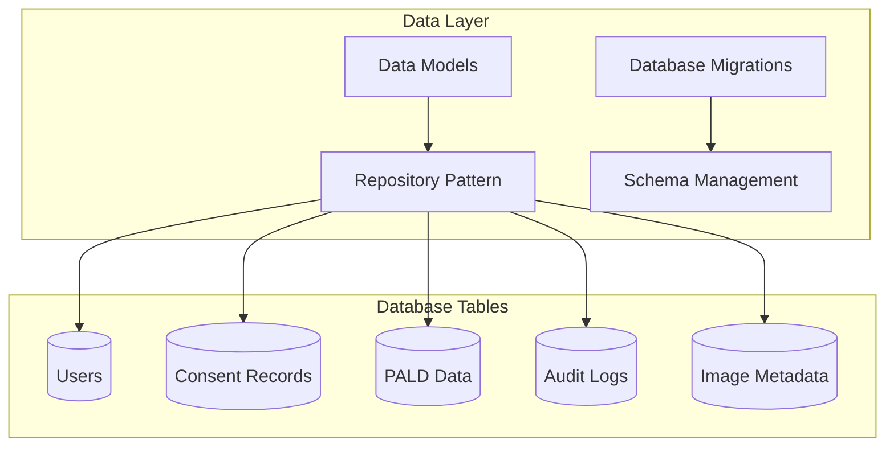

**Key Components:**
- **Data Models:** SQLAlchemy models with validation
- **Repository Pattern:** Data access abstraction
- **Migrations:** Alembic-based schema evolution
- **Schema Management:** PALD schema versioning and validation

---

## 6. Runtime View

### 6.1 User Registration Flow

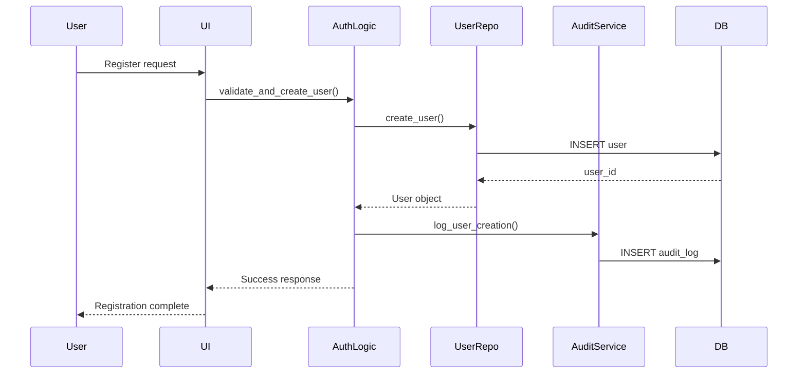

### 6.2 Chat Interaction Flow

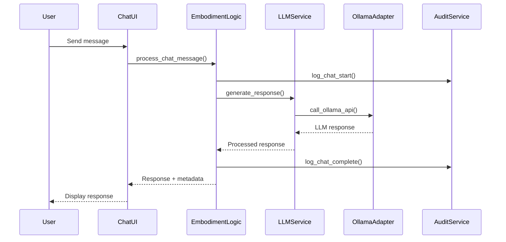

### 6.3 Image Generation Flow

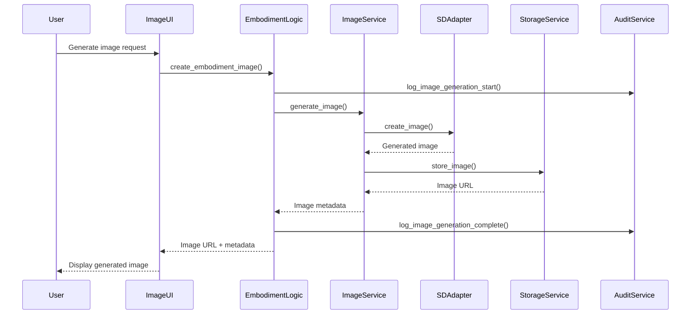

### 6.4 Federated Learning Update Flow

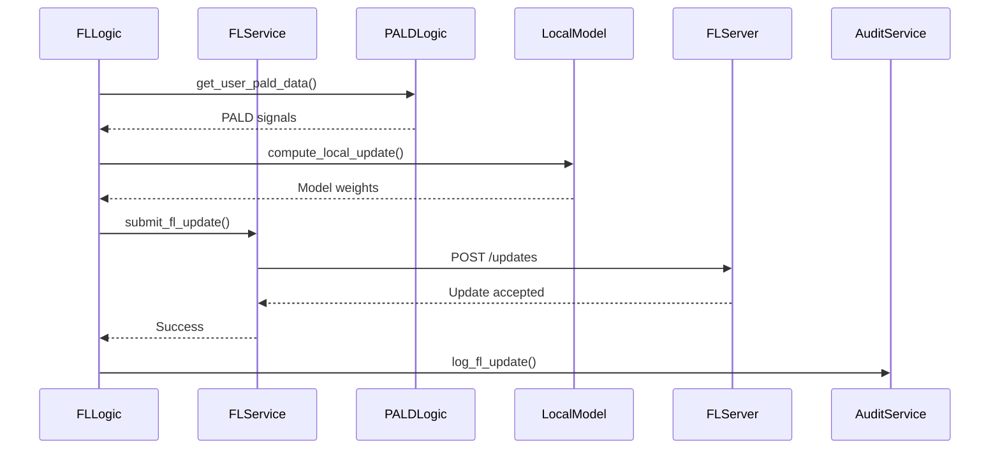

---

## 7. Deployment View

### 7.1 Development Environment

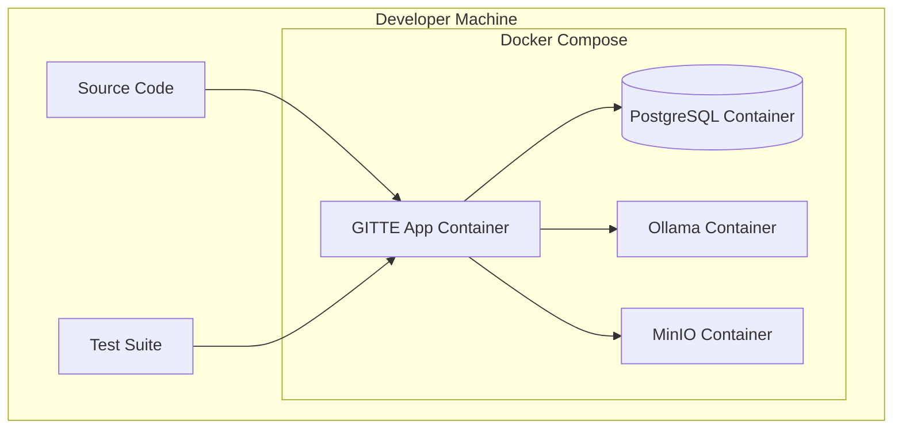

**Development Setup:**
- Docker Compose orchestrates all services
- Hot-reload enabled for rapid development
- Local volumes for persistent data
- Exposed ports for debugging

### 7.2 Production Environment

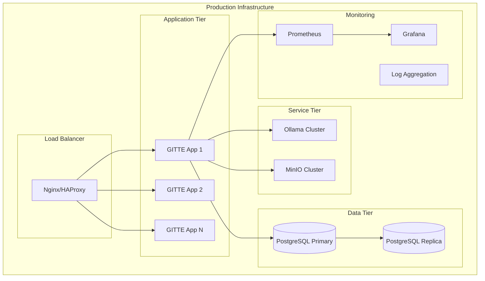

**Production Characteristics:**
- Horizontal scaling with load balancing
- Database replication for read scaling
- Comprehensive monitoring and alerting
- SSL termination at load balancer
- Container orchestration with health checks

### 7.3 Infrastructure Mapping

| Component | Development | Production |
|-----------|-------------|------------|
| **Application** | Single container | Multiple replicas behind LB |
| **Database** | Single PostgreSQL | Primary + read replicas |
| **LLM Service** | Single Ollama | Ollama cluster with GPU |
| **Storage** | Local MinIO | Distributed MinIO cluster |
| **Monitoring** | Basic logging | Prometheus + Grafana + alerts |
| **SSL** | Self-signed | Let's Encrypt certificates |

---

## 8. Cross-cutting Concepts

### 8.1 Security Concept

**Authentication & Authorization:**
- Session-based authentication with secure cookies
- Role-based access control (ADMIN, PARTICIPANT)
- Password hashing with bcrypt
- Session timeout and invalidation

**Data Protection:**
- AES-256 encryption for sensitive data
- TLS 1.2+ for all communications
- Input validation and sanitization
- SQL injection prevention with parameterized queries

**Privacy by Design:**
- Explicit consent required for all data processing
- User pseudonymization for privacy protection
- Data minimization principles
- Right to be forgotten (GDPR Article 17)

### 8.2 Error Handling Concept

**Error Categories:**
- **User Errors:** Invalid input, authentication failures
- **System Errors:** Service unavailability, resource exhaustion
- **External Errors:** Third-party service failures
- **Security Errors:** Unauthorized access attempts

**Error Handling Strategy:**
- Custom exception hierarchy for different error types
- Circuit breaker pattern for external service calls
- Graceful degradation with fallback mechanisms
- User-friendly error messages without sensitive information
- Comprehensive error logging for debugging

### 8.3 Logging and Monitoring

**Audit Logging:**
- Write-ahead logging (WAL) for all AI interactions
- Parent-child linking for conversation threads
- Request ID tracking across system components
- Comprehensive audit trail for compliance

**Application Monitoring:**
- Health checks for all services
- Performance metrics collection
- Error rate monitoring
- Resource usage tracking
- Real-time alerting for critical issues

**Log Levels:**
- **DEBUG:** Detailed diagnostic information
- **INFO:** General operational messages
- **WARNING:** Potential issues that don't affect functionality
- **ERROR:** Error conditions that affect functionality
- **CRITICAL:** Serious errors that may cause system failure

### 8.4 Configuration Management

**Configuration Sources (Priority Order):**
1. Environment variables
2. Configuration files
3. Default values in code

**Feature Flags:**
- Runtime behavior control without code changes
- A/B testing capabilities
- Gradual feature rollout
- Emergency feature disable

**Environment-Specific Configuration:**
- Development: Debug logging, local services
- Staging: Production-like setup with test data
- Production: Optimized performance, security hardening

### 8.5 Testing Strategy

**Test Pyramid:**
- **Unit Tests (70%):** Individual component testing
- **Integration Tests (20%):** Service interaction testing
- **End-to-End Tests (10%):** Complete user flow testing

**Test Categories:**
- **Functional Tests:** Feature correctness
- **Performance Tests:** Response time, throughput
- **Security Tests:** Authentication, authorization, input validation
- **Compliance Tests:** GDPR requirements, audit logging

**Test Data Management:**
- Synthetic test data generation
- Data anonymization for testing
- Test database isolation
- Automated test data cleanup

---

## 9. Architecture Decisions

### 9.1 ADR-001: 4-Layer Architecture

**Status:** Accepted  
**Date:** 2024-12-01

**Context:**
Need for maintainable, testable architecture that supports independent component development.

**Decision:**
Implement strict 4-layer architecture: UI → Logic → Service → Data

**Consequences:**
- **Positive:** Clear separation of concerns, improved testability, independent layer development
- **Negative:** Additional abstraction overhead, potential performance impact
- **Risks:** Developer discipline required to maintain boundaries

### 9.2 ADR-002: Streamlit for UI

**Status:** Accepted  
**Date:** 2024-12-01

**Context:**
Need for rapid UI development with Python integration.

**Decision:**
Use Streamlit for all user interfaces instead of separate frontend framework.

**Consequences:**
- **Positive:** Rapid development, Python integration, minimal frontend complexity
- **Negative:** Limited UI customization, potential scalability concerns
- **Risks:** Streamlit limitations may require future migration

### 9.3 ADR-003: Session-Based Authentication

**Status:** Accepted  
**Date:** 2024-12-01

**Context:**
Need for secure authentication that works well with Streamlit.

**Decision:**
Implement session-based authentication with secure cookies.

**Consequences:**
- **Positive:** Simple implementation, good Streamlit integration, stateful sessions
- **Negative:** Server-side session storage required, horizontal scaling complexity
- **Risks:** Session management overhead, potential security vulnerabilities

### 9.4 ADR-004: PostgreSQL for Primary Storage

**Status:** Accepted  
**Date:** 2024-12-01

**Context:**
Need for ACID compliance, JSON support, and mature ecosystem.

**Decision:**
Use PostgreSQL as primary database with JSON columns for flexible data.

**Consequences:**
- **Positive:** ACID compliance, JSON support, mature tooling, strong consistency
- **Negative:** Relational model constraints, potential performance limitations
- **Risks:** Schema migration complexity, scaling limitations

### 9.5 ADR-005: Docker Compose for Development

**Status:** Accepted  
**Date:** 2024-12-01

**Context:**
Need for consistent development environment across team members.

**Decision:**
Use Docker Compose for local development environment orchestration.

**Consequences:**
- **Positive:** Consistent environments, easy service management, production parity
- **Negative:** Docker learning curve, resource overhead, debugging complexity
- **Risks:** Docker-specific issues, performance impact on development

---

## 10. Quality Requirements

### 10.1 Performance Requirements

| Requirement | Target | Measurement |
|-------------|--------|-------------|
| **LLM Response Time** | Median TTFT ≤ 2s | Response time monitoring |
| **Image Generation** | P95 ≤ 30s (GPU) | Generation time tracking |
| **Database Queries** | P95 ≤ 100ms | Query performance monitoring |
| **UI Responsiveness** | Page load ≤ 3s | Frontend performance metrics |
| **Concurrent Users** | 100+ simultaneous | Load testing |

### 10.2 Reliability Requirements

| Requirement | Target | Measurement |
|-------------|--------|-------------|
| **System Availability** | 99.5% uptime | Uptime monitoring |
| **Error Rate** | <1% for critical flows | Error rate tracking |
| **Data Durability** | 99.999% | Backup verification |
| **Recovery Time** | <15 minutes | Incident response metrics |
| **Backup Frequency** | Daily automated | Backup monitoring |

### 10.3 Security Requirements

| Requirement | Implementation | Verification |
|-------------|----------------|--------------|
| **Authentication** | Session-based with bcrypt | Security testing |
| **Authorization** | Role-based access control | Permission testing |
| **Data Encryption** | AES-256 for sensitive data | Encryption verification |
| **Communication** | TLS 1.2+ for all endpoints | SSL testing |
| **Input Validation** | Comprehensive sanitization | Penetration testing |

### 10.4 Usability Requirements

| Requirement | Target | Measurement |
|-------------|--------|-------------|
| **Learning Curve** | <30 minutes for basic tasks | User testing |
| **Error Recovery** | Clear error messages | Usability testing |
| **Accessibility** | WCAG 2.1 AA compliance | Accessibility audit |
| **Mobile Support** | Responsive design | Cross-device testing |
| **Internationalization** | Multi-language support | Localization testing |

### 10.5 Compliance Requirements

| Requirement | Implementation | Verification |
|-------------|----------------|--------------|
| **GDPR Compliance** | Consent management, data deletion | Compliance audit |
| **Data Retention** | Configurable retention policies | Policy verification |
| **Audit Logging** | Comprehensive activity tracking | Log completeness check |
| **Privacy by Design** | Default privacy settings | Privacy impact assessment |
| **Right to be Forgotten** | 72-hour data deletion | Deletion verification |

---

## 11. Risks and Technical Debts

### 11.1 Technical Risks

| Risk | Probability | Impact | Mitigation |
|------|-------------|--------|------------|
| **Streamlit Scalability** | Medium | High | Monitor performance, prepare migration plan |
| **LLM Service Dependency** | Low | High | Implement fallback mechanisms, multiple providers |
| **Database Performance** | Medium | Medium | Query optimization, read replicas, caching |
| **GPU Resource Constraints** | High | Medium | CPU fallback, resource monitoring, scaling |
| **Third-party Service Outages** | Medium | Medium | Circuit breakers, graceful degradation |

### 11.2 Technical Debts

| Debt | Priority | Effort | Impact |
|------|----------|--------|--------|
| **Limited API Documentation** | High | Medium | Affects integration and maintenance |
| **Incomplete Error Handling** | Medium | Low | May cause poor user experience |
| **Missing Performance Tests** | Medium | Medium | Unknown scalability limits |
| **Hardcoded Configuration** | Low | Low | Reduces deployment flexibility |
| **Limited Monitoring** | High | High | Affects operational visibility |

### 11.3 Business Risks

| Risk | Probability | Impact | Mitigation |
|------|-------------|--------|------------|
| **GDPR Non-compliance** | Low | Critical | Regular compliance audits, legal review |
| **Data Breach** | Low | Critical | Security hardening, incident response plan |
| **Performance Degradation** | Medium | High | Performance monitoring, capacity planning |
| **User Adoption Issues** | Medium | High | User testing, feedback collection |
| **Competitive Pressure** | High | Medium | Feature differentiation, rapid iteration |

### 11.4 Mitigation Strategies

**Risk Monitoring:**
- Regular architecture reviews
- Performance benchmarking
- Security assessments
- Compliance audits

**Contingency Planning:**
- Service fallback mechanisms
- Data backup and recovery procedures
- Incident response playbooks
- Capacity scaling procedures

**Technical Debt Management:**
- Regular refactoring sprints
- Code quality metrics
- Technical debt tracking
- Architecture evolution planning

---

## 12. Glossary

| Term | Definition |
|------|------------|
| **GITTE** | Great Individual Tutor Embodiment - the system name |
| **PALD** | Pedagogical Agent Level of Design - schema for embodiment attributes |
| **Embodiment** | Visual representation/avatar of a learning assistant |
| **Federated Learning (FL)** | Distributed machine learning approach preserving privacy |
| **TTFT** | Time To First Token - latency metric for LLM responses |
| **WAL** | Write-Ahead Logging - logging technique for data consistency |
| **GDPR** | General Data Protection Regulation - EU privacy law |
| **Circuit Breaker** | Design pattern for handling service failures |
| **Pseudonymization** | Data protection technique replacing identifying information |
| **Differential Privacy** | Mathematical framework for privacy-preserving data analysis |
| **Arc42** | Template for architecture documentation |
| **ADR** | Architecture Decision Record - documentation of architectural decisions |

---

**Document Information:**
- **Version:** 1.0
- **Last Updated:** December 2024
- **Next Review:** March 2025
- **Maintainer:** GITTE Development Team